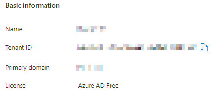

I was recently tasked with setting up internal/employee authentication using Microsoft Accounts on the new web project that my company is making, and since we're using ASP.NET Core (Blazor Server) as our framework, it was only natural for me to turn to the `Microsoft.AspNetCore.Authentication.MicrosoftAccount` library (henceforth just `MicrosoftAccount`) for this, as suggested by the [article on external provider authentication in ASP.NET](https://docs.microsoft.com/en-us/aspnet/core/security/authentication/social/).

As I said, this was _internal/employee_ authentication, so when I was registering an application for this purpose in Azure Active Directory, I selected "Accounts in this organizational directory only (_&lt;Company name&gt;_ only - Single tenant)." If you try to use the `MicrosoftAccount` with this setup without special care though, you'll undoubtedly run into this problem as soon as you actually try logging in[^guids]:

> Exception: invalid_request;Description=AADSTS50194: Application 'f552b3c4-1b53-4406-8009-03b8c5438927'(_&lt;Active Directory App Registration name&gt;_) is not configured as a multi-tenant application. Usage of the /common endpoint is not supported for such applications created after '10/15/2018'. Use a tenant-specific endpoint or configure the application to be multi-tenant. Trace ID: b3029a49-cb3d-443d-9280-662398d0701d Correlation ID: 80b4dfe5-970d-44d2-9dd9-f7c799c2094c Timestamp: 2022-06-16 07:15:37Z

I feel like this is something that the `MicrosoftAccount` library should've been updated to deal with back in 2018 when this change was made, but since it apparently isn't, we'll have to deal with it ourselves. Here's what you need to do in order to fix it.

When configuring the authentication handler, you've most likely already configured it with the client id and client secret as instructed by the article mentioned earlier; something like this:

```csharp
var configuration = builder.Configuration;
var microsoftClientId = configuration["Authentication:Microsoft:ClientId"];
var microsoftClientSecret = configuration["Authentication:Microsoft:ClientSecret"];
builder.Services.AddAuthentication().AddMicrosoftAccount(
    mso =>
    {
        mso.ClientId = microsoftClientId;
        mso.ClientSecret = microsoftClientSecret;
    });
```

In order to get this to work with a single-tenant app, you'll first need your Azure AD tenant id; you'll find this one on the "overview" page of the Azure AD blade:



Add it to your configuration, and change your `AddMicrosoftAccount` invocation to the following:

```csharp
var configuration = builder.Configuration;
var microsoftTenantId = configuration["Authentication:Microsoft:TenantId"];
var microsoftClientId = configuration["Authentication:Microsoft:ClientId"];
var microsoftClientSecret = configuration["Authentication:Microsoft:ClientSecret"];
builder.Services.AddAuthentication().AddMicrosoftAccount(
    mso =>
    {
        mso.AuthorizationEndpoint =
            $"https://login.microsoftonline.com/{microsoftTenantId}/oauth2/authorize";
        mso.TokenEndpoint =
            $"https://login.microsoftonline.com/{microsoftTenantId}/oauth2/v2.0/token";
        mso.ClientId = microsoftClientId;
        mso.ClientSecret = microsoftClientSecret;
    });
```

and voilà, single-tenant login works! Please let me know if this article helped you with solving your issue in the comments below. 😄

[^guids]: I've replaced the real GUIDs with fake ones just in case they're sensitive.
