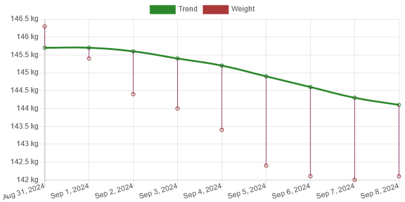
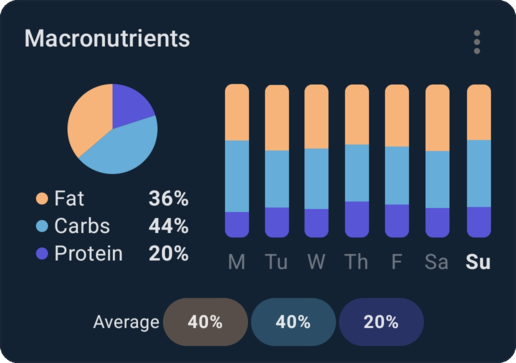
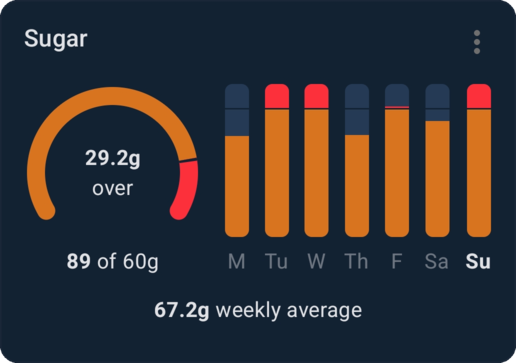

<!-- TODO: Talk about lifestyle change program
TODO: Talk about going barefoot? (Probably should be a separate post) -->

### Introduction

I've spent most of my life overweight and in poor physical shape. There's a variety of reasons for this, from being bullied in school, to dealing with chronic illness and grief, to being completely burnt out and overworked, to plain just having an eating disorder. It doesn't help that food is my main stress relief mechanism either. I'm planning to write more about each of these topics in detail at some later date if I ever get around to it.

There's varying advice out there about whether you should share your goals and aspirations with others or not. I've heard similar arguments used for whether sharing progress is a good idea as well. The arguments are as follows: One camp claims that sharing makes you accountable to others, and thus it's a good thing to do. This is the same argument as the one for having an excercise buddy, and it makes sense to me[^exercise-buddy]. The other camp says sharing with others makes you feel a sense of accomplishment in and of itself, which will lower your likeliness or motivation of actually committing to the cause as you already feel accomplished simply by sharing. I don't know who's right, but not sharing has never really done me any favors, so I thought I'd try sharing this time to see if it makes a difference.

I've been doing really well so far for reasons besides sharing so I don't think we can really draw any comparative conclusions on sharing/not sharing based on my experience with sharing alone. The older I get, the less I care about keeping things private, which helps pull me in the direction of sharing this time.

It's starting to be a while ago, so I don't remember too vividly how I felt, but the thing that I recall stood the most out to me was that I was finally enjoying being alive again after a long time of feeling depressed and exhausted. And as I often do in such cases, I try to make self improvements[^no-lazy]. Since the thing that's the most obviously wrong with me physically is my morbid obesity, I tend to start there. It helped a lot that I'd been kind of "caught" in a section of the health and exercise part of TikTok at the time[^tiktok-health], which inspired me to get started.

Conveniently, this sense of upliftedness coincided with a lifestyle change program that I had enrolled in starting roughly a week later, so not only was I able to get into the rythm before the program even started, but I was now also somewhat accountable to people outside of myself.

In the past, I've tried all kinds of diets. The one that I had the most success on was a variant on the Paleo diet called the Primal Blueprint, which, to sum it up without doing it quite enough justice, is just a low-carb elimination diet with an exercise component. However, "most success" didn't mean success to me, so I wanted to try something different this time. What mattered the most to me was that it needed to be sustainable and easy to follow, while also being effective. After a bit of research, I settled on doing a simple calories in, calories out (CICO) diet with a focus on getting high protein with a target of <Measurement>198 g</Measurement>/day[^high-protein] and high fiber with a target of <Measurement>38 g</Measurement>/day and then just eat carbohydrates and fats as I please up to my calorie target. While I'm not using it as a strict target, I also desire to eat less than <Measurement>60 g</Measurement> of sugar/day. As I'm using a smart calorie tracking app that adjusts my calorie target as I go[^calorie-app], I didn't have a set calorie target except that I configured it to set my target for any given day to be <Measurement>1000 kcal</Measurement> below maintenance.

My exercise plan isn't quite set in stone yet; currently most of my exercise capability gets used up by the lifestyle change program previously mentioned, but I do plan on signing up for a gym or working out at home once the program ends. Currently, though, I do a whole lot of walking, which has done me all kinds of wonders. My long term plans are 1. running a half marathon (<Measurement>21.1 km</Measurement> running event) and 2. following a hypertrophy program to gain some strength and put on some visual muscle. I don't plan on doing body building, but I do want to be consistent and have progression until it's no longer possible naturally.

My plan going forward is to make a post about my progress once a week, but since this is my first post about it, and I've already been doing this for over two months at this point, I'm just going to include every week up until now in this initial post. Since this means I'm going to be presenting quite a lot of data, I'm going to keep it minimal this time, and just present the summary data for the most part. In future posts where I make one post per week, I'll probably provide more in-depth information about how each week went.

Anyway, to the data! The first week will have 9 weight entries because I started on Saturday August 31, but I don't feel like making those two initial days a whole separate week entry, so I'm just incorporating them into this week for simplicity's sake. In later weeks, the first entry of a week will be the same entry as the last entry for the previous week, mainly so that the graph is continuous.

### Week 1

Week number and year: 36, 2024  
Dates: August&nbsp;31–September&nbsp;8  
Starting calorie target: <Measurement>2350 kcal</Measurement>  
End calorie target: <Measurement>2268 kcal</Measurement>

#### Weight

Here are my daily weights for this week:

| Date         | Weight                              | Trend                               | Variance                           |
| ------------ | ----------------------------------- | ----------------------------------- | ---------------------------------- |
| Aug 31, 2024 | <Measurement>146.3 kg</Measurement> | <Measurement>145.7 kg</Measurement> | <Measurement>0.6 kg</Measurement>  |
| Sep 1, 2024  | <Measurement>145.4 kg</Measurement> | <Measurement>145.7 kg</Measurement> | <Measurement>-0.3 kg</Measurement> |
| Sep 2, 2024  | <Measurement>144.4 kg</Measurement> | <Measurement>145.6 kg</Measurement> | <Measurement>-1.2 kg</Measurement> |
| Sep 3, 2024  | <Measurement>144.0 kg</Measurement> | <Measurement>145.4 kg</Measurement> | <Measurement>-1.4 kg</Measurement> |
| Sep 4, 2024  | <Measurement>143.4 kg</Measurement> | <Measurement>145.2 kg</Measurement> | <Measurement>-1.8 kg</Measurement> |
| Sep 5, 2024  | <Measurement>142.4 kg</Measurement> | <Measurement>144.9 kg</Measurement> | <Measurement>-2.5 kg</Measurement> |
| Sep 6, 2024  | <Measurement>142.1 kg</Measurement> | <Measurement>144.6 kg</Measurement> | <Measurement>-2.5 kg</Measurement> |
| Sep 7, 2024  | <Measurement>142.0 kg</Measurement> | <Measurement>144.3 kg</Measurement> | <Measurement>-2.3 kg</Measurement> |
| Sep 8, 2024  | <Measurement>142.1 kg</Measurement> | <Measurement>144.1 kg</Measurement> | <Measurement>-2.0 kg</Measurement> |

My starting weight was <Measurement>146.3 kg</Measurement> and my ending weight was <Measurement>142.1 kg</Measurement>, i.e. I had a loss of <Measurement>4.2 kg</Measurement>. This might seem absurd, but anyone who's made a serious attempt at losing weight before is used to this[^glycogen]. Long story short, it's mostly water.

I feel like I should explain what each of these numbers mean, in case it's not obvious. The "weight" number, which is represented by a red point in the graph, is the raw weight for that day. I step on the scale each morning after using the bathroom, and that's that. The "trend" number, which is represented by the points used to produce the green line in the graph, is the moving average of the weight over time. The reason it starts out below my starting weight is because I've been tracking my weight in the past as well. Long story short, the farther away the weight is from the trend value, the "harder" the trend gets pulled towards it. This lets you observe how your weight changes over time without getting caught up in day-to-day numbers, which can fluctuate quite a bit based on things like hydration status and other physiological things. The "variance" number is just the difference between the two and is represented in the graph as the vertical line from the green line to the red points.

#### Diet

My first full week was quite decent. While my fiber intake started out a bit low, I managed to bump it to the target towards the end. My protein intake was okay, but a bit low; I would've liked to have seen an average of about <Measurement>132 g</Measurement>.

These graphs are taken as screenshots from the dashboard of calorie tracking app[^calorie-app] I use. The semi-circle graphs and pie graphs on the left aren't all that interesting, as they represent the selected date (which in my screenshots will always be the Sunday of the given week of the screenshot), but the bar graphs on the right as well as the "average" numbers presented in the "macronutrients" figure show the week as a whole.

#### Exercise

- September 1: 1 hour walk that was <Measurement>2.6 km</Measurement> in distance (walking speed <Measurement>2.6 km/h</Measurement>)
- September 3: 52 minute walk that was <Measurement>3.3 km</Measurement> in distance (walking speed <Measurement>3.8 km/h</Measurement>)
- September 4: 1 hour 17 minute walk that was <Measurement>4.5 km</Measurement> in distance (walking speed <Measurement>3.5 km/h</Measurement>)
- September 5: 59 minute walk that was <Measurement>4.0 km</Measurement> in distance (walking speed <Measurement>4.1 km/h</Measurement>)

Four days of walking about an hour each with quite decent progression? Nice start! 😁

### Week 2

Week number and year: 37, 2024  
Dates: September&nbsp;8–September&nbsp;15  
Starting calorie target: <Measurement>2268 kcal</Measurement>  
End calorie target: <Measurement>2246 kcal</Measurement>

#### Weight

Here are my daily weights for this week:

| Date         | Weight                              | Trend                               | Variance                           |
| ------------ | ----------------------------------- | ----------------------------------- | ---------------------------------- |
| Sep 8, 2024  | <Measurement>142.1 kg</Measurement> | <Measurement>144.1 kg</Measurement> | <Measurement>-2.0 kg</Measurement> |
| Sep 9, 2024  | <Measurement>140.6 kg</Measurement> | <Measurement>143.7 kg</Measurement> | <Measurement>-3.1 kg</Measurement> |
| Sep 10, 2024 | <Measurement>140.8 kg</Measurement> | <Measurement>143.4 kg</Measurement> | <Measurement>-2.6 kg</Measurement> |
| Sep 11, 2024 | <Measurement>140.9 kg</Measurement> | <Measurement>143.1 kg</Measurement> | <Measurement>-2.2 kg</Measurement> |
| Sep 12, 2024 | <Measurement>140.0 kg</Measurement> | <Measurement>142.8 kg</Measurement> | <Measurement>-2.8 kg</Measurement> |
| Sep 13, 2024 | <Measurement>139.8 kg</Measurement> | <Measurement>142.5 kg</Measurement> | <Measurement>-2.7 kg</Measurement> |
| Sep 14, 2024 | <Measurement>139.9 kg</Measurement> | <Measurement>142.2 kg</Measurement> | <Measurement>-2.3 kg</Measurement> |
| Sep 15, 2024 | <Measurement>139.1 kg</Measurement> | <Measurement>141.9 kg</Measurement> | <Measurement>-2.8 kg</Measurement> |

My starting weight was <Measurement>142.1 kg</Measurement> and my ending weight was <Measurement>139.1 kg</Measurement>, i.e. I had a loss of <Measurement>3 kg</Measurement>. While not quite as absurd as last week, there's probably still some water weight loss going on here.

Already below <Measurement>140 kg</Measurement>! Nice. I hope I'm never that heavy again.

#### Diet

My second week was quite decent as well. My fiber intake ended up only <Measurement>3 g</Measurement> below target on average. My protein intake was still a bit lower than desired.

### Exercise

- September 10: Multiple walks for a total of 1 hour 32 minute walk that was <Measurement>6.0 km</Measurement> in distance (walking speed <Measurement>3.9 km/h</Measurement>)
- September 12: 1 hour 26 minute walk that was <Measurement>5.7 km</Measurement> in distance (walking speed <Measurement>4.0 km/h</Measurement>)
- September 13: 1 hour exercise under the guidance of the lifestyle change program

Not as many days as last week, but certainly more distance on each walk! Also, this week I started exercising under the guidance of the lifestyle change program, something I will be doing until it ends sometime in February. Because it's intensive at the start and tapers off at the end, I need to find a way to increase my own exercise once that happens sometime in mid November, so I don't lose my progress.

### Body composition analysis

Speaking of lifestyle change program, they have this body composition analyzer, which we all got to use to get a baseline, and this is my results at the start on September 13:

Weight: <Measurement>140.2 kg</Measurement>  
Body Mass Index: 45.2  
Basal Metabolic Rate: <Measurement>11017 kJ</Measurement>  
Fat%: 39.5&nbsp;%  
Fat Mass: <Measurement>55.4 kg</Measurement>  
Fat-free Mass: <Measurement>84.8 kg</Measurement>  
Total Body Water: <Measurement>62.1 kg</Measurement>

Desirable Range:  
Fat%: 8-20&nbsp;%  
Fat Mass: <Measurement>7.4 kg</Measurement>–<Measurement>21.2 kg</Measurement>

Segmental Analysis

**Right Leg**  
Fat%: 35.2&nbsp;%  
Fat Mass: <Measurement>5.5 kg</Measurement>  
Fat-free Mass: <Measurement>15.7 kg</Measurement>  
Predicted Muscle Mass: <Measurement>14.8 kg</Measurement>

**Left Leg**  
Fat%: 31.5&nbsp;%  
Fat Mass: <Measurement>5.5 kg</Measurement>  
Fat-free Mass: <Measurement>16.3 kg</Measurement>  
Predicted Muscle Mass: <Measurement>15.4 kg</Measurement>

**Right Arm**  
Fat%: 45.2&nbsp;%  
Fat Mass: <Measurement>4.2 kg</Measurement>  
Fat-free Mass: <Measurement>5.1 kg</Measurement>  
Predicted Muscle Mass: <Measurement>4.8 kg</Measurement>

**Left Arm**  
Fat%: 47.0&nbsp;%  
Fat Mass: <Measurement>4.4 kg</Measurement>  
Fat-free Mass: <Measurement>5.0 kg</Measurement>  
Predicted Muscle Mass: <Measurement>4.7 kg</Measurement>

**Trunk**  
Fat%: 41.8&nbsp;%  
Fat Mass: <Measurement>30.8 kg</Measurement>  
Fat-free Mass: <Measurement>42.8 kg</Measurement>  
Predicted Muscle Mass: <Measurement>41.1 kg</Measurement>

It's undeniable: I'm carrying around a lot of fat. My body is nearly 40% fat at the time of this measurement. That's... disturbing.

### Week 3

Week number and year: 38, 2024  
Dates: September&nbsp;15–September&nbsp;22  
Starting calorie target: <Measurement>2246 kcal</Measurement>  
End calorie target: <Measurement>2236 kcal</Measurement>

#### Weight

Here are my daily weights for this week:

| Date         | Weight                              | Trend                               | Variance                           |
| ------------ | ----------------------------------- | ----------------------------------- | ---------------------------------- |
| Sep 15, 2024 | <Measurement>139.1 kg</Measurement> | <Measurement>141.9 kg</Measurement> | <Measurement>-2.8 kg</Measurement> |
| Sep 16, 2024 | <Measurement>138.3 kg</Measurement> | <Measurement>141.5 kg</Measurement> | <Measurement>-3.2 kg</Measurement> |
| Sep 17, 2024 | <Measurement>138.2 kg</Measurement> | <Measurement>141.2 kg</Measurement> | <Measurement>-3.0 kg</Measurement> |
| Sep 18, 2024 | <Measurement>138.4 kg</Measurement> | <Measurement>140.9 kg</Measurement> | <Measurement>-2.5 kg</Measurement> |
| Sep 19, 2024 | <Measurement>137.7 kg</Measurement> | <Measurement>140.6 kg</Measurement> | <Measurement>-2.9 kg</Measurement> |
| Sep 20, 2024 | <Measurement>138.0 kg</Measurement> | <Measurement>140.3 kg</Measurement> | <Measurement>-2.3 kg</Measurement> |
| Sep 21, 2024 | <Measurement>138.4 kg</Measurement> | <Measurement>140.1 kg</Measurement> | <Measurement>-1.7 kg</Measurement> |
| Sep 22, 2024 | <Measurement>138.4 kg</Measurement> | <Measurement>139.9 kg</Measurement> | <Measurement>-1.5 kg</Measurement> |

My starting weight was <Measurement>139.1 kg</Measurement> and my ending weight was <Measurement>138.4 kg</Measurement>, i.e. I had a loss of <Measurement>0.7 kg</Measurement>. This is a more resonable weight to lose in fat alone, and probably was all or nearly all fat. I'm very happy with that.

#### Diet

That Thursday stands out quite a lot. Everything was lower than usual, but the fiber especially so. Looking at my dietary entries, it's quite obvious why—all my foods were highly processed, high carb foods that day! My breakfast was a hot dog, my lunch was sushi and my dinner was pizza. How I managed to stay below my calorie target that day beats me. Well done, though, past me!

#### Exercise

- September 16: Multiple walks for a total of 34 minute walk that was <Measurement>2.1 km</Measurement> in distance (walking speed <Measurement>4.2 km/h</Measurement>) + 1 hour exercise under the guidance of the lifestyle change program
- September 18: Multiple walks for a total of 55 minute walk that was <Measurement>4.0 km</Measurement> in distance (walking speed <Measurement>4.4 km/h</Measurement>)
- September 19: 2 hour 6 minute walk that was <Measurement>6.5 km</Measurement> in distance (walking speed <Measurement>3.1 km/h</Measurement>)
- September 20: 1 hour exercise under the guidance of the lifestyle change program
- September 21: 1 hour 7 minute walk that was <Measurement>5.3 km</Measurement> in distance (walking speed <Measurement>4.7 km/h</Measurement>)

All in all my most impressive week exercise-wise so far, I think!

### Week 4

Week number and year: 39, 2024  
Dates: September&nbsp;22–September&nbsp;29  
Starting calorie target: <Measurement>2236 kcal</Measurement>  
End calorie target: <Measurement>2192 kcal</Measurement>

#### Weight

Here are my daily weights for this week:

| Date         | Weight                              | Trend                               | Variance                           |
| ------------ | ----------------------------------- | ----------------------------------- | ---------------------------------- |
| Sep 22, 2024 | <Measurement>138.4 kg</Measurement> | <Measurement>139.9 kg</Measurement> | <Measurement>-1.5 kg</Measurement> |
| Sep 23, 2024 | <Measurement>137.0 kg</Measurement> | <Measurement>139.6 kg</Measurement> | <Measurement>-2.6 kg</Measurement> |
| Sep 24, 2024 | <Measurement>136.9 kg</Measurement> | <Measurement>139.3 kg</Measurement> | <Measurement>-2.4 kg</Measurement> |
| Sep 25, 2024 | <Measurement>136.4 kg</Measurement> | <Measurement>139.0 kg</Measurement> | <Measurement>-2.6 kg</Measurement> |
| Sep 26, 2024 | <Measurement>137.0 kg</Measurement> | <Measurement>138.8 kg</Measurement> | <Measurement>-1.8 kg</Measurement> |
| Sep 27, 2024 | <Measurement>136.0 kg</Measurement> | <Measurement>138.5 kg</Measurement> | <Measurement>-2.5 kg</Measurement> |
| Sep 28, 2024 | <Measurement>135.5 kg</Measurement> | <Measurement>138.2 kg</Measurement> | <Measurement>-2.7 kg</Measurement> |
| Sep 29, 2024 | <Measurement>135.4 kg</Measurement> | <Measurement>137.9 kg</Measurement> | <Measurement>-2.5 kg</Measurement> |

My starting weight was <Measurement>138.4 kg</Measurement> and my ending weight was <Measurement>135.4 kg</Measurement>, i.e. I had a loss of <Measurement>3 kg</Measurement>. For being four weeks in, that's rather impressive! I honestly can't explain how I'm losing weight that fast.

While I don't actually measure my weight in pounds, I noticed I got under 300&nbsp;lbs this week. May I never again be above 300 after this! 💪

#### Diet

Not all that much going on this week, although that fiber intake was on target and then some! Slightly low on protein, but nothing awful.

#### Exercise

- September 23: 1 hour exercise under the guidance of the lifestyle change program
- September 27: Multiple walks for a total of 33 minute walk that was <Measurement>2.2 km</Measurement> in distance (walking speed <Measurement>4 km/h</Measurement>) + 1 hour exercise under the guidance of the lifestyle change program

Must've been a rougher week; only walking I did was to and from the car getting to the lifestyle change program. The reason it's so long is that I park far enough away that I don't have to pay for parking near the premises. (_insert "we smart" GIF here_)

### Week 5

Week number and year: 40, 2024  
Dates: September&nbsp;29–October&nbsp;6  
Starting calorie target: <Measurement>2192 kcal</Measurement>  
End calorie target: <Measurement>2203 kcal</Measurement>

#### Weight

Here are my daily weights for this week:

| Date         | Weight                              | Trend                               | Variance                           |
| ------------ | ----------------------------------- | ----------------------------------- | ---------------------------------- |
| Sep 29, 2024 | <Measurement>135.4 kg</Measurement> | <Measurement>137.9 kg</Measurement> | <Measurement>-2.5 kg</Measurement> |
| Sep 30, 2024 | <Measurement>135.6 kg</Measurement> | <Measurement>137.7 kg</Measurement> | <Measurement>-2.1 kg</Measurement> |
| Oct 1, 2024  | <Measurement>135.3 kg</Measurement> | <Measurement>137.5 kg</Measurement> | <Measurement>-2.2 kg</Measurement> |
| Oct 2, 2024  | <Measurement>135.2 kg</Measurement> | <Measurement>137.3 kg</Measurement> | <Measurement>-2.1 kg</Measurement> |
| Oct 3, 2024  | <Measurement>135.0 kg</Measurement> | <Measurement>137.1 kg</Measurement> | <Measurement>-2.1 kg</Measurement> |
| Oct 4, 2024  | <Measurement>135.8 kg</Measurement> | <Measurement>137.0 kg</Measurement> | <Measurement>-1.2 kg</Measurement> |
| Oct 5, 2024  | <Measurement>135.9 kg</Measurement> | <Measurement>136.9 kg</Measurement> | <Measurement>-1.0 kg</Measurement> |
| Oct 6, 2024  | <Measurement>136.1 kg</Measurement> | <Measurement>136.8 kg</Measurement> | <Measurement>-0.7 kg</Measurement> |

My starting weight was <Measurement>135.4 kg</Measurement> and my ending weight was <Measurement>136.1 kg</Measurement>, i.e. I had a gain of <Measurement>0.7 kg</Measurement>. The rapid weight loss of the previous week being somewhat unsustainable combined with what I can only imagine was a rough week resulted in a slight weight gain this week.

You can't expect everything to go smoothly every single week. Luckily, I was mentally prepared for this and took it in relative stride. And the important part is that the _trend_ was still going down, which means everything is still on target at a large scale. 👍

#### Diet

For the most part this week went fine, but I had a couple of days that went well above my calorie targets, which pushed me over my weekly budget this week. Aside from that, everything is mostly like before—slightly low protein, fiber intake more or less on target. Looking at the two days when I went over, I consumed fairly large amounts of snacks on those days. If I recall correctly, they were rough days, and as food is my stress relief mechanism, it's not all that unexpected.

#### Exercise

- October 3: 1 hour 2 minute walk that was <Measurement>3.3 km</Measurement> in distance (walking speed <Measurement>3.2 km/h</Measurement>)
- October 4: 1 hour 45 minute walk under the guidance of frisklivssentralen that was <Measurement>4.8 km</Measurement> in distance (walking speed <Measurement>2.7 km/h</Measurement>)
- October 5: 1 hour 8 minute walk that was <Measurement>3.4 km</Measurement> in distance (walking speed <Measurement>3 km/h</Measurement>)

The lifestyle change program had this week off, which is why there's no exercise with them this week.

### Week 6

Week number and year: 41, 2024  
Dates: October&nbsp;6–October&nbsp;13  
Starting calorie target: <Measurement>2203 kcal</Measurement>  
End calorie target: <Measurement>2162 kcal</Measurement>

#### Weight

Here are my daily weights for this week:

| Date         | Weight                              | Trend                               | Variance                           |
| ------------ | ----------------------------------- | ----------------------------------- | ---------------------------------- |
| Oct 6, 2024  | <Measurement>136.1 kg</Measurement> | <Measurement>136.8 kg</Measurement> | <Measurement>-0.7 kg</Measurement> |
| Oct 7, 2024  | <Measurement>135.3 kg</Measurement> | <Measurement>136.6 kg</Measurement> | <Measurement>-1.3 kg</Measurement> |
| Oct 8, 2024  | <Measurement>135.0 kg</Measurement> | <Measurement>136.4 kg</Measurement> | <Measurement>-1.4 kg</Measurement> |
| Oct 9, 2024  | <Measurement>134.6 kg</Measurement> | <Measurement>136.2 kg</Measurement> | <Measurement>-1.6 kg</Measurement> |
| Oct 10, 2024 | <Measurement>134.4 kg</Measurement> | <Measurement>136.0 kg</Measurement> | <Measurement>-1.6 kg</Measurement> |
| Oct 11, 2024 | <Measurement>133.8 kg</Measurement> | <Measurement>135.8 kg</Measurement> | <Measurement>-2.0 kg</Measurement> |
| Oct 12, 2024 | <Measurement>133.5 kg</Measurement> | <Measurement>135.6 kg</Measurement> | <Measurement>-2.1 kg</Measurement> |
| Oct 13, 2024 | <Measurement>133.3 kg</Measurement> | <Measurement>135.4 kg</Measurement> | <Measurement>-2.1 kg</Measurement> |

My starting weight was <Measurement>136.1 kg</Measurement> and my ending weight was <Measurement>133.3 kg</Measurement>, i.e. I had a loss of <Measurement>2.8 kg</Measurement>. Certainly back on track, but that was probably another too intense week.

#### Diet

Much the same as week 4—protein low, fiber above target and calories pretty much on target.

#### Exercise

- October 7: Multiple walks for a total of 29 minute walk that was <Measurement>2.1 km</Measurement> in distance (walking speed <Measurement>4.3 km/h</Measurement>) + 1 hour exercise under the guidance of the lifestyle change program
- October 8: Multiple walks for a total of 1 hour 18 minute walk that was <Measurement>4.9 km</Measurement> in distance (walking speed <Measurement>3.8 km/h</Measurement>)
- October 9: Multiple walks for a total of 52 minute walk that was <Measurement>2.4 km</Measurement> in distance (walking speed <Measurement>2.8 km/h</Measurement>)
- October 10: Multiple walks for a total of 58 minute walk that was <Measurement>2.7 km</Measurement> in distance (walking speed <Measurement>2.8 km/h</Measurement>)
- October 11: Multiple walks for a total of 29 minute walk that was <Measurement>1.9 km</Measurement> in distance (walking speed <Measurement>3.9 km/h</Measurement>) + 1 hour exercise under the guidance of the lifestyle change program

Lots of walking this week!

### Body composition analysis

Had another go on the body composition analyzer on October 11; let's see if anything's changed:

Weight: <Measurement>133.7 kg</Measurement> (down <Measurement>6.5 kg</Measurement>)  
Body Mass Index: 43.2 (down 2)  
Basal Metabolic Rate: <Measurement>11042 kJ</Measurement> (up <Measurement>25 kJ</Measurement>)  
Fat%: 36.8&nbsp;% (down 2.7&nbsp;<abbr title="percentage points">%pt</abbr>)  
Fat Mass: <Measurement>49.2 kg</Measurement> (down <Measurement>6.2 kg</Measurement>)  
Fat-free Mass: <Measurement>84.5 kg</Measurement> (down <Measurement>0.3 kg</Measurement>)  
Total Body Water: <Measurement>61.5 kg</Measurement> (down <Measurement>0.6 kg</Measurement>)

Desirable Range:  
Fat%: 8-20&nbsp;%  
Fat Mass: <Measurement>7.4 kg</Measurement>–<Measurement>21.2 kg</Measurement>

Segmental Analysis

**Right Leg**  
Fat%: 30.9&nbsp;% (down 4.3&nbsp;<abbr title="percentage points">%pt</abbr>)  
Fat Mass: <Measurement>4.9 kg</Measurement> (down <Measurement>0.6 kg</Measurement>)  
Fat-free Mass: <Measurement>15.6 kg</Measurement> (down <Measurement>0.1 kg</Measurement>)  
Predicted Muscle Mass: <Measurement>14.8 kg</Measurement> (no change)

**Left Leg**  
Fat%: 31.5&nbsp;% (down 2.8&nbsp;<abbr title="percentage points">%pt</abbr>)  
Fat Mass: <Measurement>5.0 kg</Measurement> (down <Measurement>0.5 kg</Measurement>)  
Fat-free Mass: <Measurement>16.2 kg</Measurement> (down <Measurement>0.1 kg</Measurement>)  
Predicted Muscle Mass: <Measurement>15.0 kg</Measurement> (down <Measurement>0.4 kg</Measurement>)

**Right Arm**  
Fat%: 38.8&nbsp;% (down 6.4&nbsp;<abbr title="percentage points">%pt</abbr>)  
Fat Mass: <Measurement>3.2 kg</Measurement> (down <Measurement>1.0 kg</Measurement>)  
Fat-free Mass: <Measurement>5.0 kg</Measurement> (down <Measurement>0.1 kg</Measurement>)  
Predicted Muscle Mass: <Measurement>4.8 kg</Measurement> (no change)

**Left Arm**  
Fat%: 38.9&nbsp;% (down 8.1&nbsp;<abbr title="percentage points">%pt</abbr>)  
Fat Mass: <Measurement>3.8 kg</Measurement> (down <Measurement>0.6 kg</Measurement>)  
Fat-free Mass: <Measurement>5.0 kg</Measurement> (no change)  
Predicted Muscle Mass: <Measurement>4.9 kg</Measurement> (up <Measurement>0.2 kg</Measurement>)

**Trunk**  
Fat%: 39.4&nbsp;% (down 2.4&nbsp;<abbr title="percentage points">%pt</abbr>)  
Fat Mass: <Measurement>30.8 kg</Measurement> (down <Measurement>2 kg</Measurement>)  
Fat-free Mass: <Measurement>42.8 kg</Measurement> (up <Measurement>0.3 kg</Measurement>)  
Predicted Muscle Mass: <Measurement>42.0 kg</Measurement> (up <Measurement>0.9 kg</Measurement>)

Not entirely sure why my left leg lost some muscle, but otherwise these numbers are amazing. Lots of fat loss and generally little change otherwise, which matches my experience as I have not really done any hypertrophy training, so I'm not expecting much muscle gain.

### Week 7

Week number and year: 42, 2024  
Dates: October&nbsp;13–October&nbsp;20  
Starting calorie target: <Measurement>2162 kcal</Measurement>  
End calorie target: <Measurement>2158 kcal</Measurement>

#### Weight

Here are my daily weights for this week:

| Date         | Weight                              | Trend                               | Variance                           |
| ------------ | ----------------------------------- | ----------------------------------- | ---------------------------------- |
| Oct 13, 2024 | <Measurement>133.3 kg</Measurement> | <Measurement>135.4 kg</Measurement> | <Measurement>-2.1 kg</Measurement> |
| Oct 14, 2024 | <Measurement>133.0 kg</Measurement> | <Measurement>135.2 kg</Measurement> | <Measurement>-2.2 kg</Measurement> |
| Oct 15, 2024 | <Measurement>132.7 kg</Measurement> | <Measurement>134.9 kg</Measurement> | <Measurement>-2.2 kg</Measurement> |
| Oct 16, 2024 | <Measurement>132.4 kg</Measurement> | <Measurement>134.6 kg</Measurement> | <Measurement>-2.2 kg</Measurement> |
| Oct 17, 2024 | <Measurement>133.2 kg</Measurement> | <Measurement>134.5 kg</Measurement> | <Measurement>-1.3 kg</Measurement> |
| Oct 18, 2024 | <Measurement>133.3 kg</Measurement> | <Measurement>134.4 kg</Measurement> | <Measurement>-1.1 kg</Measurement> |
| Oct 19, 2024 | <Measurement>133.3 kg</Measurement> | <Measurement>134.3 kg</Measurement> | <Measurement>-1.0 kg</Measurement> |
| Oct 20, 2024 | <Measurement>133.0 kg</Measurement> | <Measurement>134.2 kg</Measurement> | <Measurement>-1.2 kg</Measurement> |

My starting weight was <Measurement>133.3 kg</Measurement> and my ending weight was <Measurement>133.0 kg</Measurement>, i.e. I had a loss of <Measurement>0.3 kg</Measurement>. Overall, it seems like my weight stayed pretty flat. And my trend? Still going down.

#### Diet

The week started out fine, but on Wednesday, I basically "fell off the wagon" of my diet. You can tell every day after that I went above my calorie target and I had an excess of nearly <Measurement>2900 kcal</Measurement> over the course of the week!

Usually when I fall off the wagon in my attempts to get healthier, it's over—I stop trying and go back to my old habits. This time around, though, I was going to let my failure run its natural course, but with the intention of immediately getting back on track as soon as I am able.

#### Exercise

- October 14: Multiple walks for a total of 34 minute walk that was <Measurement>1.7 km</Measurement> in distance (walking speed <Measurement>4.3 km/h</Measurement>) + 1 hour exercise under the guidance of the lifestyle change program
- October 17: Multiple walks for a total of 45 minute walk that was <Measurement>2.4 km</Measurement> in distance (walking speed <Measurement>3.2 km/h</Measurement>)
- October 18: Multiple walks for a total of 39 minute walk that was <Measurement>2.2 km</Measurement> in distance (walking speed <Measurement>3.4 km/h</Measurement>)

Along with my failure to eat well, I also basically stopped exercising this week; I went to the lifestyle change program on Friday, but did not participate in the exercise program. And this trend would continue for a while.

### Week 8

Week number and year: 43, 2024  
Dates: October&nbsp;20–October&nbsp;27  
Starting calorie target: <Measurement>2158 kcal</Measurement>  
End calorie target: <Measurement>2137 kcal</Measurement>

#### Weight

Here are my daily weights for this week:

| Date         | Weight                              | Trend                               | Variance                           |
| ------------ | ----------------------------------- | ----------------------------------- | ---------------------------------- |
| Oct 20, 2024 | <Measurement>133.0 kg</Measurement> | <Measurement>134.2 kg</Measurement> | <Measurement>-1.2 kg</Measurement> |
| Oct 21, 2024 | <Measurement>133.3 kg</Measurement> | <Measurement>134.1 kg</Measurement> | <Measurement>-0.8 kg</Measurement> |
| Oct 22, 2024 | <Measurement>133.2 kg</Measurement> | <Measurement>134.0 kg</Measurement> | <Measurement>-0.8 kg</Measurement> |
| Oct 23, 2024 | <Measurement>133.3 kg</Measurement> | <Measurement>133.9 kg</Measurement> | <Measurement>-0.6 kg</Measurement> |
| Oct 24, 2024 |                                     | _Missing data_                      |                                    |
| Oct 25, 2024 | <Measurement>133.4 kg</Measurement> | <Measurement>133.8 kg</Measurement> | <Measurement>-0.4 kg</Measurement> |
| Oct 26, 2024 | <Measurement>134.0 kg</Measurement> | <Measurement>133.8 kg</Measurement> | <Measurement>0.2 kg</Measurement>  |
| Oct 27, 2024 | <Measurement>134.1 kg</Measurement> | <Measurement>133.8 kg</Measurement> | <Measurement>0.3 kg</Measurement>  |
| Oct 28, 2024 | <Measurement>134.3 kg</Measurement> | <Measurement>133.9 kg</Measurement> | <Measurement>0.4 kg</Measurement>  |
| Oct 29, 2024 | <Measurement>133.8 kg</Measurement> | <Measurement>133.9 kg</Measurement> | <Measurement>-0.1 kg</Measurement> |

My starting weight was <Measurement>133.0 kg</Measurement> and my ending weight was <Measurement>133.8 kg</Measurement>, i.e. I had a gain of <Measurement>0.8 kg</Measurement>. Looks like I missed a day too. It happens. As October 29 is the last day I make an entry in a while, I included the 28th and the 29th here despite them technically being the next week; that way I don't have to have a week with just two entries in week 9.

Here you can see the trend being heavily affected by my falling off the wagon and I do go as high as <Measurement>134.3 kg</Measurement> this week, which actually pulls my trend _up_ slightly.

#### Diet

I think this is my worst week yet. I had an excess of over <Measurement>3800 kcal</Measurement> this week! That's enough calories to put on over <Measurement>0.45 kg</Measurement> of fat. Not a great situation to be in.

#### Exercise

- October 21: Multiple walks for a total of 41 minute walk that was <Measurement>2.8 km</Measurement> in distance (walking speed <Measurement>4.1 km/h</Measurement>)
- October 25: Multiple walks for a total of 30 minute walk that was <Measurement>1.1 km</Measurement> in distance (walking speed <Measurement>2.2 km/h</Measurement>)

Here's my continued lack of exercise showing. The walking present here was all required walking.

### Week 9

Week number and year: 44, 2024  
Dates: October&nbsp;27–November&nbsp;3  
Starting calorie target: <Measurement>2137 kcal</Measurement>  
End calorie target: <Measurement>2136 kcal</Measurement>

#### Weight

I included two of the days this week in the previous week, otherwise I did not weigh myself this week. That's not a good sign. It usually means I'm about to give up entirely. Fortunately for me, I cought myself before I completely derailed, but it's unfortunate that it came to this at all. Still, one of the reasons I'm writing this post (and hopefully also more in the future) is to make myself a bit more accountable. So this should be the only big gap I have, if everything goes to plan.

#### Diet

I kept my calorie tracking up slightly longer than I kept up my weighing, but it faltered basically just two days later. As you can tell by the lack of checkmarks on Friday and Saturday, they were not marked as completed by me, because I didn't bother registering everything I consumed. And by Sunday, I had stopped entirely. And despite missing a whole day and only partially entering two others, I had a registered excess of <Measurement>2767 kcal</Measurement> that week. The real number is probably in the 3000–4000 range.

I think the only positive I can draw here is that I got a lot of protein in on that Tuesday. 😅

#### Exercise

- November 1: Multiple walks for a total of 41 minute walk that was <Measurement>2.8 km</Measurement> in distance (walking speed <Measurement>4.1 km/h</Measurement>)

I only showed up for the lifestyle change program once this week and I didn't exercise.

### Summary

And that's it for the "catching up on my progress so far" post! Amusingly (but not intentionally, I promise) I've left it on kind of a cliffhanger! _Will I get back on track? Will I fail even harder? Tune in next week for the shocking truth!_ 😂 See you then!

If you made it this far, have a final graph showing the whole period so far:

[^exercise-buddy]: If you're not familiar with the concept of an exercise buddy system, the idea is that on days where you don't feel like exercising, you have soembody to hold you accountable. The supposed magic of this system is that even on days where you both would have avoided exercise individually, you plan to have one of you message the other something like "wanna go to the gym today?" and the other one should basically be obliged to always answer "yeah, let's go!" which means that you always end up going short of illness or other valid excuses.

[^no-lazy]: This is one of the reasons I don't believe laziness exists. I want to write more about that in its own post at a later time, but long story short—there's no such thing as a lazy person—if you actually try to get to the bottom of why any given apparently lazy person seems lazy, there's always going to be an underlying cause; anything from depression and exhaustion to unmet needs or an underlying medical condition. I intend to link to said future post here once I write it, but there's a chance I'll forget. 😅

[^tiktok-health]: If anyone's curious, the people on TikTok who ended up inspiring me to make the changes and choices I did were, in order of importance/influence: [Liam (theplantslant)](https://www.tiktok.com/@theplantslant), [Ben Carpenter (bdccarpenter)](https://www.tiktok.com/@bdccarpenter), [morticia 🥀 (𝔟𝔩𝔬𝔬𝔡𝔣𝔩𝔬𝔴𝔢𝔯)](https://www.tiktok.com/@MS4wLjABAAAAtUWuRxxxwoaCb2659sECxjGF0mt6Vga6jMxmhcrSV4SKy7zYBA57_38ipyc7jTUm) and a British TikToker whose account I forgot to follow/save apparently, which is rather embarassing. I'll add him in here if I find him later.

[^high-protein]: Don't worry, I've since realized this is quite unnecessarily high and I never even got close on any given day anyway.

[^calorie-app]: I'm using the app called [Calorie Counter by Lose It!](https://play.google.com/store/apps/details/?id=com.fitnow.loseit&hl=en-US) for which I bought premium a while ago since I found it to be worth paying for. I can't really comment on what it's like without premium anymore, as it's been too long. They also have an app for iOS if you uh... don't like being in control of your phone, I guess?

[^glycogen]: Most of the weight lost here was retained water. When you're eating in caloric maintenance or excess, your body will hold on to extra water due to stored glycogen in your muscles. As far as I can tell from the literature, your body will hold on to 3–4 times as much water as you have glycogen stored, and your body will typically store about <Measurement>1 kg</Measurement> of glycogen, meaning that if you wipe out all your glycogen, you lose up to <Measurement>5 kg</Measurement> of weight.
