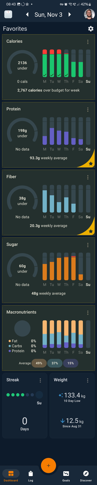
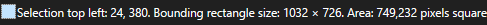
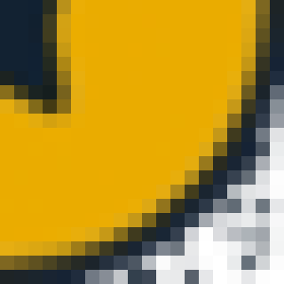
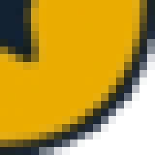

Yesterday I published my post on [starting my weight loss and health journey in 2024](/blog/2024/11/09/weight-loss-2024), and in it, I included a bunch of images that were extracted from screenshots from my calorie tracking app. I don't know if I technically have enough readers for this, but I thought that if I had come across that blog post written by someone else, I would have this question myself, and so I thought I'd preemptively respond to it—"how did you get those graphs extracted from screenshots of your calorie tracking app?"

The most obvious way to do it is to just open every one in an image editor, and then meticulously and tediously crop and edit them so they look the way you want. Since I'm a lazy software engineer, this obviously wouldn't do for me. Why would I do something manually when I can program the machine to do it for me? Not every task that can be automated should be—if you spend 2 hours on automating a task that takes 10 minutes to do manually and you only need to do this task once, you've wasted 110 minutes[^joy-and-learning]! The [xkcd](https://xkcd.com/) comic named [Is It Worth the Time?](https://xkcd.com/1205/) feels appropriate for this, so I'm going to insert it[^xckd-attribution]:


I think it's optimistic to think I'm going to need to (or be able to) stick with posting these weight loss and health journey updates for five years, but I figured I could use one year as a relatively safe estimate, and so we need to divide the number we find in the chart by 5 for a more realistic take on my situation. I figure it would take me—perhaps overly pessimistically—somewhere around 10 minutes to do the task manually each time, but let's be optimistic and pick the **5 minutes shaved off** row. I'll be doing the task weekly after the initial post where I had to do a bunch of them, so let's pick the **weekly** column. That means I'm allowed to spend up to `21 / 5 =` 4.2 hours on doing the task before it's going to be losing me time rather than gaining me time to automate[^avoiding-tedium].

I didn't time myself, but preparing the automation script—both the research and the development—took me less than an hour, so it was definitely worthwhile to do in this case. As I alluded to in my title, I used [ImageMagick](https://imagemagick.org/)[^imagemagick] to perform this automation. My process went: I'd open the dashboard of my calorie tracking app for a week, do a scrolling screenshot[^scrolling-screenshot] of the whole thing. This left me with screenshots where each graph that I wanted to extract would have the same coordinate and size/shape in each one, making it perfectly suited for automation. Here's an example screenshot that I took, where I've also annotated the sections I wanted to extract with a semi-transparent yellow rectangle:



The way I went about getting the numbers I needed was to use the selection tool in my graphics editor of choice—[paint.net](https://www.getpaint.net/)—which shows the position and size of the selection bounds, like this:



Based on this, we can see that I need to start the extraction at pixel 24, 380 and extract a region that is of size 1032 x 726 pixels. As an argument to ImageMagick, that looks like `-crop 1032x726+24+380`. Next, you can see that the graphs are rounded rectangles, and I wanted to remove the background in the corners so that when they are placed, they fit in better with the background there. To do this, I noted the color of the background, which turned out to be `srgb(13,26,42)`—and which luckily didn't feature elsewhere in the image, or this might've been more complicated[^advanced-cropping]. To remove it, we'll issue the following arguments to ImageMagick: `-fuzz 2% -transparent "srgb(13,26,42)"`. The `fuzz` argument makes arguments that accept colors also accept colors that are close to the provided color in RGB space. Since the source screenshots produced by my phone arrive as JPEG[^jpeg], we need this to avoid getting noise in the output.

Here's an example of the difference that makes in the lower-right corner of one graph in the screenshot, where I've run the command without `-fuzz 2%` on the left and with `-fuzz 2%` on the right and put a white background instead of transparency on the images to fully highlight the differences:

<Juxtapose id="imagemagick-fuzz">





</Juxtapose>

Finally, the images ended up being about twice as large as I needed them to be, so in order to reduce them by half, I added the argument `-resize 50%`. Another observation we can make is that all the rectangles are all the same size, so for each one, I only had to figure out the coordinates, as their size will be the same. The final conversion script thus ended up being

```bash
magick $inputFilePath -crop 1032x726+24+380 -fuzz 2% -transparent "srgb(13,26,42)" -resize 50% "${outputFileNameBase}_calories.png"
magick $inputFilePath -crop 1032x726+24+1130 -fuzz 2% -transparent "srgb(13,26,42)" -resize 50% "${outputFileNameBase}_protein.png"
magick $inputFilePath -crop 1032x726+24+1880 -fuzz 2% -transparent "srgb(13,26,42)" -resize 50% "${outputFileNameBase}_fiber.png"
magick $inputFilePath -crop 1032x726+24+2630 -fuzz 2% -transparent "srgb(13,26,42)" -resize 50% "${outputFileNameBase}_sugar.png"
magick $inputFilePath -crop 1032x726+24+3380 -fuzz 2% -transparent "srgb(13,26,42)" -resize 50% "${outputFileNameBase}_macros.png"
```

where `$inputFilePath` is the path to the screenshot image and `$outputFileNameBase` is the file name base of the output file. An example of invocation was `./extract-images screenshot_20241103.jpg diet43`[^week43], which produced images named `diet43_{graphType}.png`, which I then used in my blog post.

[^joy-and-learning]: That said—if you get joy and/or learning out of automating the task, it may still be worth doing; not everything has to be measured solely against time spent or saved!
[^xckd-attribution]: xkcd comics are produced by Randall Munroe and licensed under a [Creative Commons Attribution-NonCommercial 2.5 License](https://creativecommons.org/licenses/by-nc/2.5/)
[^avoiding-tedium]: I will readily admit, though, that in this case (and many others), I would much rather waste some additional time than have to do the tedious task, because sometimes my sanity or reducing the effort of the task is worth more than the absolute time spent. Wanting pixel perfect crop-outs from a screenshot is simply an incredibly tedious and time-consuming task to be doing, and it's also so fabulously easily automated that it's an open and shut case for automation.
[^imagemagick]: ImageMagick truly feels like magic, and it's incredibly feature-rich and capable of enormously diverse and advanced tasks. If you haven't used it before, you're honestly missing out. I've been using it for as long as I can remember; it's been around since 1990!
[^scrolling-screenshot]: [Scrolling screenshots](https://support.google.com/android/answer/9075928?hl=en) are honestly one of my most favorite Android features. Based on a cursory web search, they also appear to be available on iOS. It's incredibly handy, and everyone should be aware they exist!
[^advanced-cropping]: I haven't really looked into this since I haven't needed it, but it would not at all surprise me if ImageMagick supported cropping that had rounded corners, which would probably have been my next go-to solution should I have needed it.
[^jpeg]: JPEG artifacts are close to—but not equal—to their surrounding color.
[^week43]: If you're curious what the 43 is about, I track my progress on a weekly basis, and this screenshot was for week 43 of 2024.
