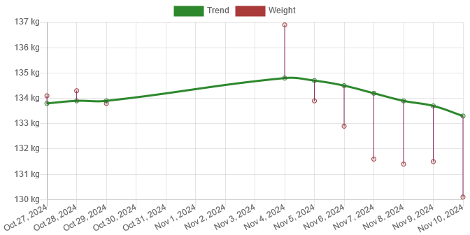
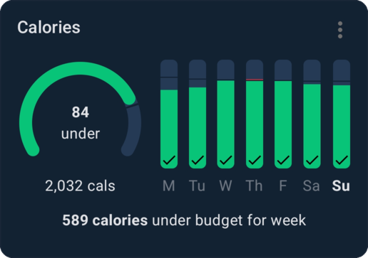
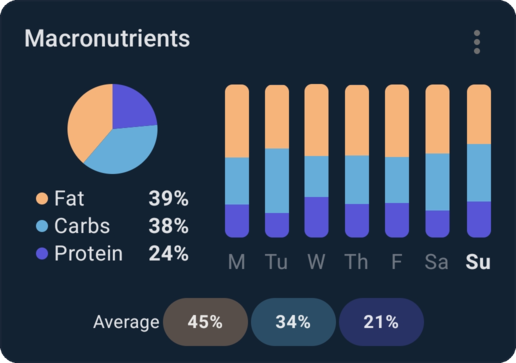
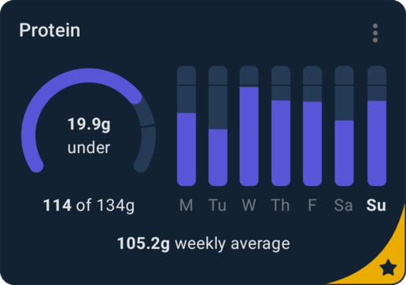
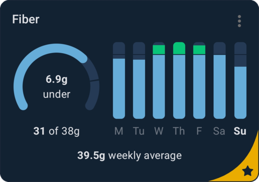
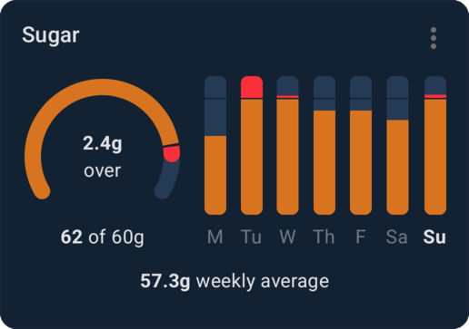
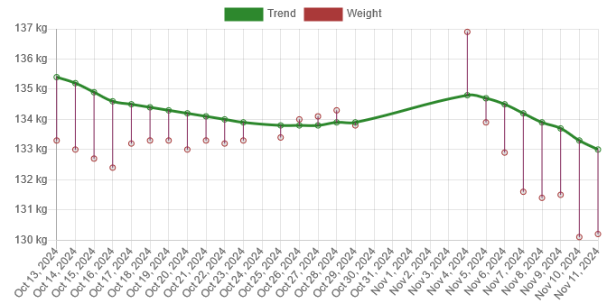

Dates: November 3–November 10  
Starting calorie target: <Measurement>2136 kcal</Measurement>  
End calorie target: <Measurement>2116 kcal</Measurement>

I cheekily ended my last post on a "cliffhanger," but since I alluded to in it several times that I was getting back on track, it should come as a surprise to nobody that it's been a good week for me.

I mostly finished this blog post yesterday, but due to being incredibly busy all day yesterday I didn't have time to finalize it until this morning, which is why it's coming on Tuesday instead of Monday—the planned day.

#### Weight

| Date               | Weight                              | Trend                               | Variance                           |
| ------------------ | ----------------------------------- | ----------------------------------- | ---------------------------------- |
| Oct 27, 2024       | <Measurement>134.1 kg</Measurement> | <Measurement>133.8 kg</Measurement> | <Measurement>0.3 kg</Measurement>  |
| Oct 28, 2024       | <Measurement>134.3 kg</Measurement> | <Measurement>133.9 kg</Measurement> | <Measurement>0.4 kg</Measurement>  |
| Oct 29, 2024       | <Measurement>133.8 kg</Measurement> | <Measurement>133.9 kg</Measurement> | <Measurement>-0.1 kg</Measurement> |
| Oct 30–Nov 3, 2024 |                                     | _Missing data_                      |                                    |
| Nov 4, 2024        | <Measurement>136.9 kg</Measurement> | <Measurement>134.8 kg</Measurement> | <Measurement>2.1 kg</Measurement>  |
| Nov 5, 2024        | <Measurement>133.9 kg</Measurement> | <Measurement>134.7 kg</Measurement> | <Measurement>-0.8 kg</Measurement> |
| Nov 6, 2024        | <Measurement>132.9 kg</Measurement> | <Measurement>134.5 kg</Measurement> | <Measurement>-1.6 kg</Measurement> |
| Nov 7, 2024        | <Measurement>131.6 kg</Measurement> | <Measurement>134.2 kg</Measurement> | <Measurement>-2.6 kg</Measurement> |
| Nov 8, 2024        | <Measurement>131.4 kg</Measurement> | <Measurement>133.9 kg</Measurement> | <Measurement>-2.5 kg</Measurement> |
| Nov 9, 2024        | <Measurement>131.5 kg</Measurement> | <Measurement>133.7 kg</Measurement> | <Measurement>-2.2 kg</Measurement> |
| Nov 10, 2024       | <Measurement>130.1 kg</Measurement> | <Measurement>133.3 kg</Measurement> | <Measurement>-3.2 kg</Measurement> |

My starting weight was <Measurement>136.9 kg</Measurement> and my ending weight was <Measurement>130.1 kg</Measurement>, i.e. I had a loss of <Measurement>6.8 kg</Measurement>. As I mentioned several times in the original weight loss post, it's going to be mostly water. I still ended up <Measurement>2.3 kg</Measurement> lower than any earlier weight registered, which has me fairly convinced it's also some actual weight loss. 😄

I included two weeks' worth of weights this time, mostly for the sake of continuity. Most of week 44 was missing anyway[^trend-interpolation].

It wasn't exactly _fun_ stepping on the scale on Tuesday and seeing <Measurement>136.9 kg</Measurement>, but based on experience and knowledge, I knew it wasn't the "real" number and that it would come off quick. Already by day 2, I was almost back down to where I was before the gap, and by day 4, I was lower than my lowest previous weight on October 16.

I've been entering my weight data for many years at this point. Obviously, there are many gaps; I stop entering weights routinely during bad periods. I thought it'd be fun to look back in time at old entries and see when I last weighed what I do at the end of each week as we go forward. I'm going to be using the trend value for this, as it's less extreme and not to mention continuous. The last time my trend was roughly at <Measurement>133.3 kg</Measurement> was on April 7, 2023, about a year and a half ago!

#### Diet

I'm thrilled with how I ate this week. My macros are good, my calorie intake is good, my protein is, while not at target, getting closer, and my fiber intake is above target on average.

For breakfast[^breakfast-timing], I consistently ate an overnight oatmeal I prepared the day before. It was ~<Measurement>760 kcal</Measurement>[^reduced-oats]. It comprises <Measurement>200 ml</Measurement> quick oats, <Measurement>200 ml</Measurement> whole milk, <Measurement>200 ml</Measurement> kefir, 4 teaspoons of chia seeds, 4 teaspoons of flax seeds, and ~<Measurement>60 g</Measurement> of blueberries. I soak the oats and the seeds in the milk overnight[^forgot-oats], but I only add the berries right before I eat it. I mix the berries into the oatmeal, and then finally I put cinnamon on top before consuming it. Not only is it a tasty meal, it's also very filling and is great nutritionally!

For lunch, apart from Tuesday, I consistently ate scrambled eggs with a side of vegetables. As the kind and amount of vegetables I ate varied, the meal didn't have consistent macros or energy amount, but it found itself somewhere between <Measurement>600 kcal</Measurement>–<Measurement>760 kcal</Measurement>. My scrambled eggs are remarkably simple. I use 4 eggs[^reduced-eggs], <Measurement>30 g</Measurement> of heavy whipping cream, and a sprinkling of salt, and then I beat the mixture until smooth. I cook it, stirring near-continuously until the mixture has solidified and is only ever so slightly still wet, which only takes a few minutes at most. For vegetables, I sometimes used green beans and sometimes green peas. I'm probably going to stick with green peas going forward. Even though they're more caloric than the green beans, they also have a better taste and texture and are also fairly high in protein. On Tuesday, I had a cauliflower soup named _Mere Mat Blomkålsuppe med Persillerot og Nepe_, which was only <Measurement>305 kcal</Measurement>. I compensated for this low caloric amount with some Christmas cookies between lunch and dinner, amounting to ~<Measurement>250 kcal</Measurement> additional calories.

Dinners are where I truly get variety. Well, I eat from the same pool of meals, but at least there's some amount of variety. It found itself somewhere between <Measurement>520 kcal</Measurement>–<Measurement>710 kcal</Measurement>. On Monday and Tuesday, I ate this homemade (both in terms of recipe and preparation) chicken curry with rice and broccoli with butter; on Wednesday, I ate salmon with green beans; on Thursday and Friday, I had homemade (both in terms of recipe and preparation) chili with cheese and a side of broccoli with butter on the first day, and a side of green beans the second day. On Saturday, I had breaded cod with a sauce made of basil and parmesan. This one is a pre-made frozen meal; specifically, it is _Lofoten Knasende Sprø Torsk med Basilikum- & Parmesansaus_. Along with this, I had broccoli with butter. Finally, on Sunday, dinner was chicken wok with rice. The wok sauce is homemade, but for the wok vegetables, I use a frozen vegetable mix named _Findus Wok Classic_.

Finally, I had some snacks here and there. Most days I had a few Christmas cookies, on three of the days I had an orange, and on Friday I went out to a coffee shop branch of [Espresso House](https://espressohouse.com/en) with some of my fellow weight loss program participants where I had a cortado with a small piece of dark chocolate.

#### Exercise

- **November 5**:
  - Walking for <Walk hours={1} minutes={8} distance={4.4} />
- **November 6**:
  - Walking for <Walk hours={1} minutes={44} distance={7.7} />
- **November 8**:
  - Walking for <Walk minutes={51} distance={3.7} />
  - 1 hour of exercise under the guidance of the lifestyle change program
- **November 10**:
  - Walking for <Walk hours={1} minutes={50} distance={6.7} />

This week I walked for <Walk hours={3} minutes={8+44+51+50} distance={4.4+7.7+3.7+6.7} />.

#### Final thoughts

I'm having to reduce my intake because of an ever-lowering calorie target; I could eat ~<Measurement>2400 kcal</Measurement> at the start of my journey, but now I need only ~<Measurement>2100 kcal</Measurement>; that's "half a meal"'s worth of calories lost. So I reduced the size of my breakfast and lunch to compensate.

Going forward, I'm thinking of making another change as well—I'm going to try eating at a <Measurement>1000 kcal</Measurement> deficit for 3 weeks, then do one week with a <Measurement>500 kcal</Measurement> deficit, and repeat this over and over. I believe this will help reduce "diet fatigue" by letting me have a slightly less demanding week at regular intervals, which will hopefully prevent a future "falling off the wagon" from happening again like it did in the October–November transition.

I've signed up for a gym, and I'm currently researching how I'm going to be training. Hopefully, I'll have that ready by next Monday for my next post. I'll most likely be basing my routine on [Mike Israetel's Renaissance Strength or Hypertrophy program](https://rpstrength.com/), but we'll see what I land on in the future.

I'm going to be posting the graph for the last 30 days at the bottom of each post going forward, which shows progress on a larger scale as well. Here it is for today:

I only showed up for the lifestyle change program on Friday this week since I was still recovering a bit on Monday, but I at least gave it my all on Friday! I also did a lot of walking this week. On Sunday night I signed up for a gym as starting week 47 there will no longer be Friday appointments with the lifestyle change program, and I want to transition into exercising on my own so I don't stop going.

[^trend-interpolation]: Here you get a decent illustration of how the trend line keeps going despite there being entries missing. On October 29, it was <Measurement>133.9 kg</Measurement> and by November 4, it was <Measurement>134.8 kg</Measurement>. The tracking software linearly interpolates intermediate weights between the last entry before the gap and the first entry after the gap and then uses those to calculate where the trend would've ended up if I had been adding those interpolated weights. The effect of this is that the larger the gap, the greater the effect the first entry after the gap will have on the trend.

[^breakfast-timing]: I make sure I have my breakfast sometime around 7-9. I ended up having it later some days, but I do better when I don't start eating late in the day. My natural inclination is to wait to eat until I'm hungry, which leads me to put off breakfast until around 12, but when I do this, I often never stop feeling hungry for the rest of the day. Once I started enforcing an earlier breakfast, my through-the-day hunger is more blunted and easier to manage, so that's what I'm going to keep doing.

[^reduced-oats]: All days except Sunday, where I reduced the amounts of oats and dairy by 1/4 and it went down to <Measurement>603 kcal</Measurement>. The amount of oats and dairy was <Measurement>150 ml</Measurement> instead of <Measurement>200 ml</Measurement>. I intend to eat this reduced amount going forward. The reason for this reduction is that my calorie target keeps shrinking as I am, and I need to save some calories here and there to still make it below target comfortably. Especially because I enjoy having a little room for treats.

[^forgot-oats]: If I forgot to make it the day before, I prepare it as soon as I get up, and it's at least tolerable to eat after about two hours. I can eat warm oatmeal, but I don't care for it nearly as much as I do the cold one, so I'd rather keep eating the overnight variant. Apparently I'm the odd one out here—I've heard that many people don't care for the texture of overnight oats.

[^reduced-eggs]: Similar to the oats, I also started reducing my scrambled eggs by 1/4 on Saturday, and so now and going forward, it uses 3 eggs and ~<Measurement>23 g</Measurement> of heavy cream instead.
