Dates: November 10–November 17  
Starting calorie target: <Measurement>2116 kcal</Measurement>  
End calorie target: <Measurement>2090 kcal</Measurement>

It's been an amazing week, to be honest. Not only because I've met my dietary and exercise goals, but because I've been really busy, and it's been great to be out and about having things to do, places to be, people to see.

One consequence of this, though—at least with my lack of planning—is that the consistent eating that I laid plans for last week hasn't really come through. Since I was on the go often, I had to resort to options I could find on the go, which even included eating fast food! (_gasp_)

Since I found that having to write this on Mondays can be challenging, I'm starting it on Sunday this week. While I can't record my final diet results until after today is over, I already have my weights, which I take in the mornings.

#### Weight

| Date         | Weight                              | Trend                               | Variance                            |
| ------------ | ----------------------------------- | ----------------------------------- | ----------------------------------- |
| Nov 10, 2024 | <Measurement>130.1 kg</Measurement> | <Measurement>133.3 kg</Measurement> | <Measurement>-3.2 kg </Measurement> |
| Nov 11, 2024 | <Measurement>130.2 kg</Measurement> | <Measurement>133.0 kg</Measurement> | <Measurement>-2.8 kg </Measurement> |
| Nov 12, 2024 | <Measurement>129.7 kg</Measurement> | <Measurement>132.7 kg</Measurement> | <Measurement>-3.0 kg </Measurement> |
| Nov 13, 2024 | <Measurement>129.6 kg</Measurement> | <Measurement>132.4 kg</Measurement> | <Measurement>-2.8 kg </Measurement> |
| Nov 14, 2024 | <Measurement>129.5 kg</Measurement> | <Measurement>132.1 kg</Measurement> | <Measurement>-2.6 kg </Measurement> |
| Nov 15, 2024 | <Measurement>129.7 kg</Measurement> | <Measurement>131.9 kg</Measurement> | <Measurement>-2.2 kg </Measurement> |
| Nov 16, 2024 | <Measurement>128.4 kg</Measurement> | <Measurement>131.5 kg</Measurement> | <Measurement>-3.1 kg </Measurement> |
| Nov 17, 2024 | <Measurement>128.3 kg</Measurement> | <Measurement>131.2 kg</Measurement> | <Measurement>-2.9 kg </Measurement> |

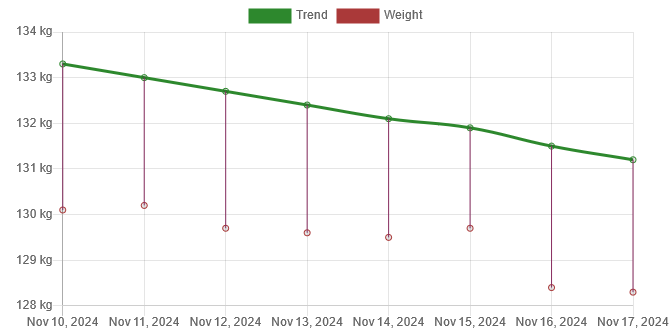

My starting weight was <Measurement>130.1 kg</Measurement> and my ending weight was <Measurement>128.3 kg</Measurement>, i.e., I had a loss of <Measurement>1.8 kg</Measurement>. Nearly two kilos in one week? Nothing to sneeze at!

This week is also an excellent illustration of why you can't look at your day-to-day weight to get a sense of progress. Notice how my weight is barely budging all week and then suddenly on Saturday morning it drops <Measurement>1.3 kg</Measurement> from the day before? I've seen this a bunch of times before. Whatever the cause, the body seems to want to hold on to its current weight at all costs until it suddenly can't, and then it'll "let go" and let you drop for a while, until you once again reach one of these "set points" or "plateaus" and have to go through it all over again. What matters most is that you stay consistent when this happens and don't get discouraged. If you can't weigh yourself without having a reaction to the daily number, I'd probably suggest going with less frequent weigh-ins.

That puts me below <Measurement>130 kg</Measurement>! I retroactively decided that my prize for meeting this milestone was that I got to join a gym. I mentioned joining a gym briefly in the summary section of [last week's post](/blog/2024/11/12/weight-loss-2024-week-45/), and I'll have more to say about that later in the exercise section.

I think I forgot to mention what my prize for making it below <Measurement>140 kg</Measurement> was in [my initial post](/blog/2024/11/09/weight-loss-2024/). At the time I rewarded myself with a special meal that I don't normally eat, which may not seem like a productive thing to do when eating healthy and losing weight is the goal, but it didn't cause me any trouble, so I don't think it's necessarily a bad thing. But I don't want each milestone prize to be food-based, so I'm trying to think of other options. Give me suggestions in the comments if you have any. 😊

To continue the tradition from last time, the last time my trend was roughly at <Measurement>131.2 kg</Measurement> was on April 27, 2022, about two and a half years ago!

#### Diet

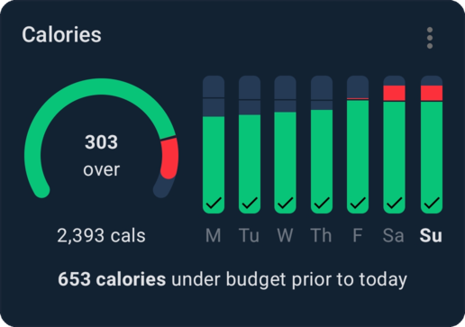

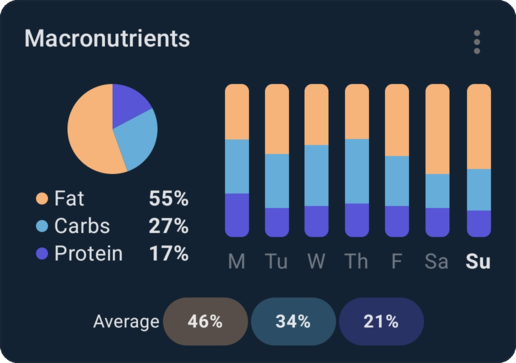

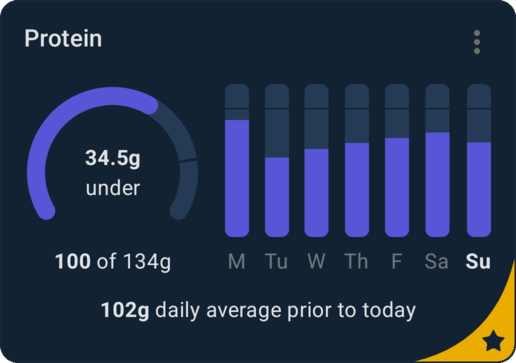

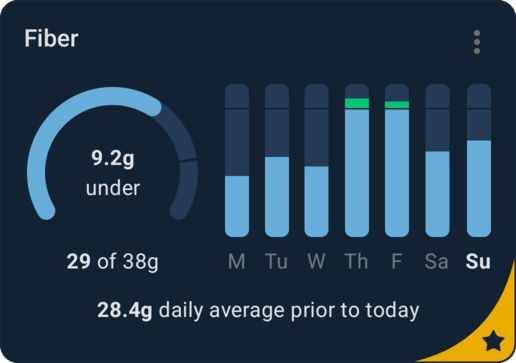

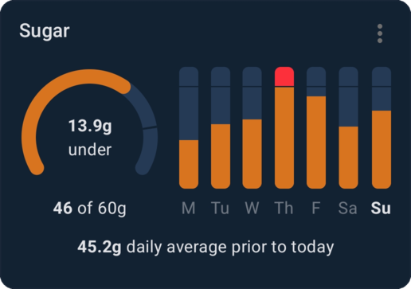

Not a terrible week for calories, but my protein and fiber intake was kind of lacking. As mentioned earlier, I ate on the go quite a few times this week, and I guess the foods I ended up eating weren't nearly as high in protein and fiber as the things I make at home. I need to look at my calendar ahead of time so I can bring healthy food with me instead of having to rely on being home or making it home in time for a meal and otherwise resorting to less ideal choices.

The reason the calories were kind of high on Saturday and Sunday this week was that we were having a traditional Norwegian Christmas dinner on those days[^christmas-dinner], and traditional Norwegian Christmas dinners are absurdly high in calories—as high _per meal_ as a person's daily maintenance calorie budget! I compensated for this, however, and I'm only over my targets by exactly <Measurement>303 kcal</Measurement> on both days[^matching-calories]. Since I wanted to keep eating my usual breakfast, the calories had to come out of lunch.

For breakfast, I consistently ate an overnight oatmeal I prepared the day before[^routine-meals], except on Tuesday where I was on the go and had a bacon and egg breakfast muffin with a cortado and a small piece of dark chocolate for ~<Measurement>612 kcal</Measurement>.

For lunch, I had a Club Sandwich meal at a fast-food restaurant called [Fly Chicken](https://www.flychicken.no/). Since they don't post calories, I don't have a clue how many calories it was, but I estimated it at <Measurement>600 kcal</Measurement>. On Tuesday—as mentioned in the breakfast paragraph—I had a different breakfast than usual, and so I had my breakfast oats for lunch. On Wednesday, I went grocery shopping for lunch and grabbed a microwave meal from the clearance section, which came out to <Measurement>730 kcal</Measurement>. On Thursday, I had a chickpea and chicken soup named _Mere Mat Krydret Kikert- og Kyllingsuppe_, which was only <Measurement>322 kcal</Measurement>. On Friday, I _finally_ got to have a serving of my scrambled eggs with vegetables[^routine-meals]. I would just have two [crispbread](https://en.wikipedia.org/wiki/Crispbread)s with a couple of over-easy eggs on Saturday and a serving of [mackerel in tomato sauce](https://no-m-wikipedia-org.translate.goog/wiki/Makrell_i_tomat?_x_tr_sl=no&_x_tr_tl=en&_x_tr_hl=en&_x_tr_pto=wapp) on Sunday.

For dinner, I had chicken breast with pan sauce and potatoes on Monday (<Measurement>607 kcal</Measurement>), homemade chicken curry with rice and broccoli with butter on Tuesday and Wednesday (~<Measurement>525 kcal</Measurement>), homemade chili with green beans on Thursday and with broccoli on Friday (<Measurement>617 kcal</Measurement> and <Measurement>726 kcal</Measurement> respectively), and [pinnekjøtt](https://en.wikipedia.org/wiki/Pinnekj%C3%B8tt) with rutabaga purée and potatoes on Saturday and Sunday (<Measurement>1385 kcal</Measurement> and <Measurement>1169 kcal</Measurement> respectively).

Finally, I had some snacks here and there. One reason my calories are below my target most days this week is because there were some days I had no snacks. Nothing else of interest to report in the snack department apart from me buying and trying these chickpea-based puffed corn-like snacks. Apart from being slightly lower in calories and having some fiber, it's mostly just an inferior experience to the real deal.

#### Exercise

- **November 11**:
  - Walking for <Walk hours={1} minutes={4} distance={4.2} />
- **November 12**:
  - Walking for <Walk hours={1} minutes={8} distance={4.8} />
  - ~1 hour of strength training at the gym
- **November 13**:
  - Walking for <Walk minutes={37} distance={2.4} />
- **November 14**:
  - Walking for <Walk minutes={48} distance={3.2} />
  - ~1 hour of strength training at the gym
- **November 15**:
  - Walking for <Walk hours={1} minutes={51} distance={4.9} />
  - 30 minutes of exercise under the guidance of the lifestyle change program
- **November 16**:
  - Walking for <Walk minutes={21} distance={1.4} />
  - ~1 hour of strength training at the gym
- **November 17**:
  - Walking for <Walk hours={1} minutes={12} distance={4.9} />

This week I walked for <Walk hours={3} minutes={4+8+37+48+51+21+12} distance={4.2+4.8+2.4+3.2+4.9+1.4+4.9} />. That is slightly more, but still comparable to last week. The only walking I did strictly for the sake of walking this week was on Sunday. All the other walking served as going somewhere and doing something else. I used to drive to most of my appointments and errands, but I try to use public transit mostly these days. As a result, I get a lot more walking in naturally, and so I don't have to put in a lot of intentional walking to compensate.

While I signed up for the gym last week, this week is when I started going. My plan is to go three times per week, ideally on Tuesdays, Thursdays, and Saturdays. To plan the details of my routine, I did some research and found an app called [Fitbod](https://fitbod.me/)[^fitbod]. They give you a workout program tailored to your fitness goal, available equipment, experience, and so on. The relevant settings that I set were that my goal was strength training, that my experience was that I'm a beginner, and to give me exercises that target fresh muscles[^fresh-muscles]. Here are my exercise summaries from Fitbod this week:

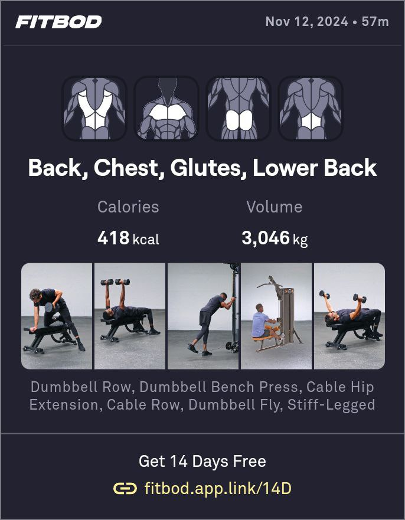

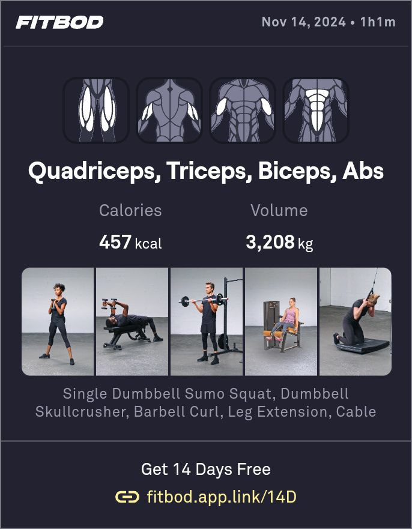

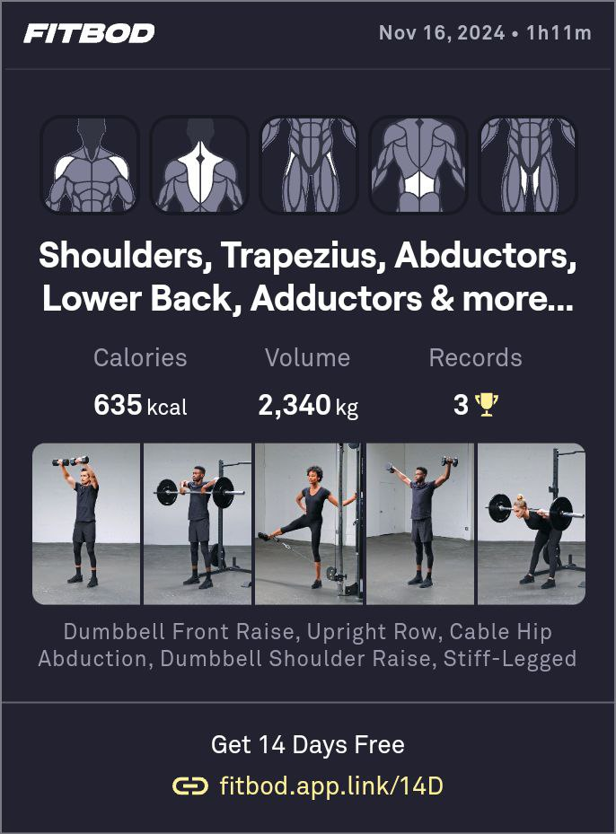

The first two were mostly auto-generated; on Saturday I did a bit of customization to include muscles the app didn't, but I'm not sure I'll bother going forward. While there's probably some utility to exercising abductors, adductors, and the trapezius, they're probably not super important for strength alone, which is my current focus. Maybe they'll start being included automatically later when/if I change out strength for hypertrophy or switch from beginner to intermediate or advanced experience.

#### Sleep

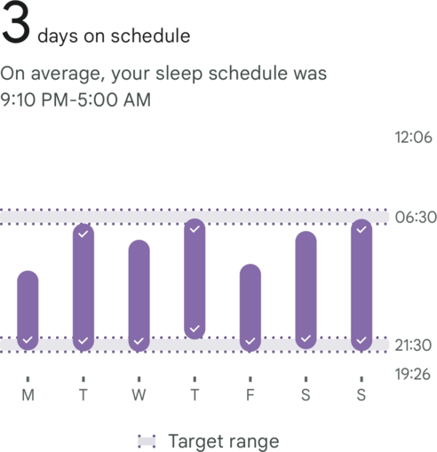

I thought I'd include sleep this week in addition to diet and exercise, since it's also an important component in health. My whole life I've been a "perfect sleeper," but ever since around September this year, I've been struggling more. The pattern above is not uncommon for me, where I sleep well 3 or 4 days in a week and have 3-4 bad to awful days. Basically, if I wake up too late _and_ too early at the same time (which basically means after 03:00), I struggle notably more to get back to sleep.

#### Final thoughts

Like I said at the start of this post, it's been an amazing week. I'm afraid it won't last though. I've been on again off again under the weather since, like, mid-week, and I'm not getting better. Maybe continuing to exercise was a mistake, although the Internet assured me that if my symptoms were all "above the neck" (which they were), it'd be fine to exercise.

Because of feeling sick and having had quite poor sleep last night, today's probably not going to be an on-target day as far as my diet is concerned. But my fallback goal now is my maintenance calorie target, and not just a "free-for-all." This should ensure, at least in theory, that I only have pauses in my progress, not setbacks. And having an extra <Measurement>1000 kcal</Measurement> to work with is almost two full meals' worth!

I also want to make a small correction to my diet fatigue compensation plan. I think having reductions after only 3 weeks is too short. Instead, I'm planning on doing 3 months at a <Measurement>1000 kcal</Measurement> deficit and then gradually/linearly working my way up to maintenance over the course of a month before starting another 3 month <Measurement>1000 kcal</Measurement> deficit. This plan is loosely based on Renaissance Periodization's [Chronic Dieting post](https://rpstrength.com/blogs/articles/chronic-dieting).

Here is the graph for the last 30 days for today:

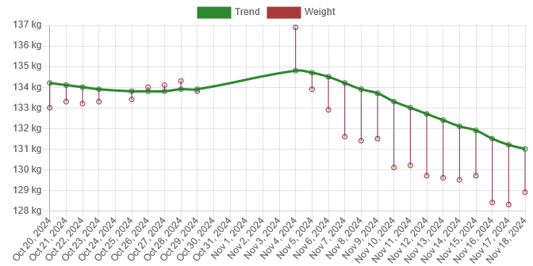

[^christmas-dinner]: Specifically, we had [pinnekjøtt](https://en.wikipedia.org/wiki/Pinnekj%C3%B8tt) with rutabaga purée and potatoes. The meat by itself has a caloric density of ~<Measurement>450 kcal</Measurement> per <Measurement>100 g</Measurement> (dry), and a serving is around <Measurement>400 g</Measurement> per person dry or <Measurement>600 g</Measurement> per person reconstituted, i.e. ~<Measurement>1792 kcal</Measurement>. You can see why this gets out of hand quickly. You eat sides with the meal, and those who choose to imbibe in alcohol will get additional calories there, and then finally, it's common to have dessert after. So it's obviously not a meal you should have regularly if caloric restriction is what you're after.

[^matching-calories]: I wasn't aiming for being that exact; it's just an amusing coincidence!

[^routine-meals]: For details on my morning oatmeal and scrambled eggs with vegetables, see [last week's post](/blog/2024/11/12/weight-loss-2024-week-45/).

[^fitbod]: It's a subscription-based service, but they give you a free trial to test their app first. I'm still trialing, but will probably pay to keep using it as I like how it works very much.

[^fresh-muscles]: The app tracks which exercises you do and estimates how much that exerts your muscles. It reports this in the UI as percent recovered. 0% means your muscle has been completely worked to death; 100% means your muscle has fully recovered. It accounts for muscles worked both as the primary target of an exercise and muscles that are secondarily involved in targeting other muscles. Assuming they know what they're talking about, this means I shouldn't ever overwork any single muscle group, which is nice.
