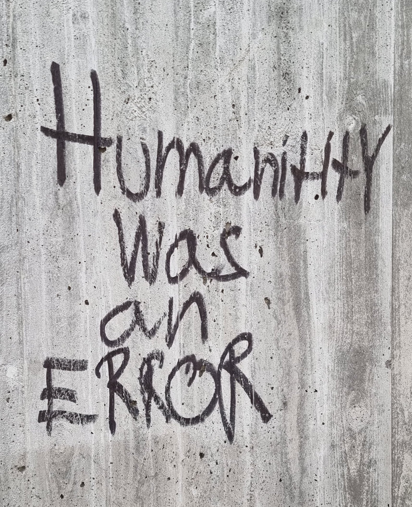

While walking along a busy road recently, I noticed some graffiti scrawled across a concrete wall. The graffiti stood out starkly against the gray, lifeless concrete, surrounded by the hum of passing cars and bikers. It read, simply: “Humanity was an ERROR.”

Graffiti often fades into the background, but this message lingered in my mind. In its blunt phrasing, it seemed to capture a sentiment shared by many disillusioned by humanity’s impact on the world. I couldn’t help but reflect: Is humanity truly an error, or is there another way to interpret our existence?

I cannot presume to know what the author of the message was thinking or feeling, or what the true intent behind their message is. The word _error_ here likely means mistake—whether one of nature, divine intent, or some other force, depending on your worldview. I understand where they're coming from. Humans have a long history of causing harm—wars, environmental destruction, exploitation, and the desecration of our planet’s ecosystems. Nearly every part of the planet and every facet of life has felt the impact of humanity’s choices. Yet, humanity has also achieved profound progress: breathtaking art, scientific breakthroughs, acts of selflessness, and social movements that push us toward justice and equity. To move forward, we must recognize and acknowledge our flaws while leaning into the parts of us that create, repair and heal rather than destroy. Fortunately, there are examples of less harmful ways of living, both contemporary and historical, that offer valuable lessons.

There are examples of less awful cultures and/or societies among humanity, both contemporary and historic that I'm sure we could all learn something from. Many Indigenous communities, for example, have lived sustainably and in harmony with their environments for generations. These cultures often value interconnection, respect for nature, and communal responsibility—practices that modern, industrialized societies could draw a lot of inspiration from. The Nordic model of social welfare, cooperative economies, and even the rise of global movements for human rights highlight that humanity is also capable of creating systems that foster care and sustainability.

If we use these examples as blueprints, it might guide how we improve as individuals and as a collective. Small actions—like embracing mindfulness, adopting sustainable practices, fostering kindness, and holding systems accountable—can cascade into larger societal shifts.

It's a hopeful thought that rather than dwelling on the "error," humanity can choose to be the correction.
