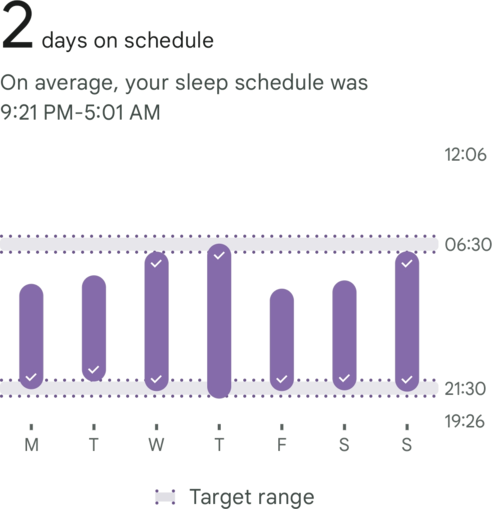

Dates: November 17–November 24  
Starting calorie target: <Measurement>2090 kcal</Measurement>  
End calorie target: <Measurement>2072 kcal</Measurement>

Some weeks are great. Some weeks are bad. And then you have weeks like this one. Kids these days might use the word _mid_ about it; personally, I'd go with _mediocre_. While bad weeks are arguably more interesting, I'd rather have a mediocre week than a bad one. Since it was a rather bland and uninteresting week, let's just get to the data, as there's really not that much more to report.

#### Weight

| Date         | Weight                              | Trend                               | Variance                           |
| ------------ | ----------------------------------- | ----------------------------------- | ---------------------------------- |
| Nov 17, 2024 | <Measurement>128.3 kg</Measurement> | <Measurement>131.2 kg</Measurement> | <Measurement>-2.9 kg</Measurement> |
| Nov 18, 2024 | <Measurement>128.9 kg</Measurement> | <Measurement>131.0 kg</Measurement> | <Measurement>-2.1 kg</Measurement> |
| Nov 19, 2024 | <Measurement>129.5 kg</Measurement> | <Measurement>130.8 kg</Measurement> | <Measurement>-1.3 kg</Measurement> |
| Nov 20, 2024 | <Measurement>128.6 kg</Measurement> | <Measurement>130.6 kg</Measurement> | <Measurement>-2.0 kg</Measurement> |
| Nov 21, 2024 | <Measurement>128.4 kg</Measurement> | <Measurement>130.4 kg</Measurement> | <Measurement>-2.0 kg</Measurement> |
| Nov 22, 2024 | <Measurement>128.5 kg</Measurement> | <Measurement>130.2 kg</Measurement> | <Measurement>-1.7 kg</Measurement> |
| Nov 23, 2024 | <Measurement>128.3 kg</Measurement> | <Measurement>130.0 kg</Measurement> | <Measurement>-1.7 kg</Measurement> |
| Nov 24, 2024 | <Measurement>127.1 kg</Measurement> | <Measurement>129.7 kg</Measurement> | <Measurement>-2.6 kg</Measurement> |

My starting weight was <Measurement>128.3 kg</Measurement> and my ending weight was <Measurement>127.1 kg</Measurement>, i.e., I had a loss of <Measurement>1.2 kg</Measurement>. As you can see, I lost almost all the weight on a single day—the last one. This experience is a common one for people trying to lose weight. If I'd fussed over weight on a day-by-day basis, I might've thought I plateaued. I'm sure you've all heard it before, but you should therefore not be hung up on your day-to-day weight.

The last time my trend was roughly at <Measurement>129.7 kg</Measurement> was on April 17, 2022, only ten days before my trend from last week. If it's not already obvious, April 2022 was clearly a month of heavy weight gain for me.

#### Diet

I was nearly <Measurement>1000 kcal</Measurement> over my calorie budget this week, more or less entirely because of Monday. Still, since I more or less stayed on target every other day, I'd call the week overall successful in the diet department.

There was nothing special about that Monday, per se; I just didn't have it in me to hold back my hunger and cravings. Still, I stuck to my secondary target, which is to not eat much above maintenance[^secondary-target]. My intake was ~<Measurement>1000 kcal</Measurement> above my target, and since my target is <Measurement>1000 kcal</Measurement> below maintenance, I succeeded. If I continue to "fail" in this manner, I should only ever lose or maintain my weight, never gain, and to be perfectly honest, after all this time eating at a deficit, that Monday felt like a feast in comparison.

On Saturday, I started supplementing my protein intake with protein shakes. As much as I'm sure I _could_ increase my protein intake naturally, for one I really enjoy the way I'm currently eating, and I don't want to risk making my successful deficit intake boring or negative in other ways, and second, adding or substituting in more protein in my meals would add to my food cost, which I honestly don't have that much room for in my (monetary) budget these days. Not that protein shakes are free, but they are an insanely cheap protein source per gram of protein compared to "real" food.

For breakfast, I consistently ate an overnight oatmeal I prepared the day before. To change things up, I bought crushed flax seeds, which my partner helpfully pointed out could be a source of cyanide. But, based on [what I found](https://nutritionfacts.org/blog/is-the-cyanide-in-flaxseed-harmful/), you'd have to eat enormous amounts of it to actually hurt yourself—[it was found to be safe to have over eight tablespoons per day](https://www.nutritionletter.tufts.edu/ask-experts/are-cyanide-levels-in-flaxseed-safe/), and I only eat 4 teaspoons in my oatmeal. Still, because of my partner's warning, I stopped eating flax seed this week, but I found a way to start safely incorporating it again next week. I also substituted my fresh blueberries for a frozen forest berry mix. While the fresh blueberries are tasty, they're something like 4 times the cost per unit of weight, _and_ I believe there are more health benefits to eating all the various berries rather than the single one; the forest berry mix contains blueberries, blackberries, redcurrant, and blackcurrant. Starting on Saturday, I also started adding <Measurement>5 g</Measurement> of honey, mostly to offset the increased sourness of the berries compared to the blueberries. If honey has some health benefits—of which I have heard rumors—all the better. Due to all these changes, my meal's calories differed quite a bit, but the one I settled on at the end of the week came out to <Measurement>540 kcal</Measurement>.

For lunch, I had my scrambled eggs with vegetables four of the days. The exceptions were Monday, where I had <Measurement>350 g</Measurement> of [medister](https://no-m-wikipedia-org.translate.goog/wiki/Medister?_x_tr_sl=no&_x_tr_tl=en&_x_tr_hl=en&_x_tr_pto=wapp)kaker, which were responsible for me meeting my protein target on that day (<Measurement>784 kcal</Measurement>), Wednesday, where I forgot to have lunch, and Thursday, where I bought some high-fiber breakfast rolls and had those with [mackerel in tomato sauce](https://no-m-wikipedia-org.translate.goog/wiki/Makrell_i_tomat?_x_tr_sl=no&_x_tr_tl=en&_x_tr_hl=en&_x_tr_pto=wapp) and [smörgåskaviar](https://en.wikipedia.org/wiki/Sm%C3%B6rg%C3%A5skaviar) (<Measurement>999 kcal</Measurement>).

For dinner, I had chicken wok on Monday (<Measurement>688 kcal</Measurement>), breaded cod with a sauce made of lemon and parsley with green beans and potatoes on Tuesday and Friday (<Measurement>535 kcal</Measurement>), [pinnekjøtt](https://en.wikipedia.org/wiki/Pinnekj%C3%B8tt) with rutabaga purée and potatoes on Wednesday (<Measurement>1199 kcal</Measurement>), breaded cod with a sauce made of basil and parmesan with broccoli and potatoes on Tuesday (<Measurement>621 kcal</Measurement>) and homemade chili with green beans on Saturday and Sunday (<Measurement>572 kcal</Measurement> and <Measurement>543 kcal</Measurement> respectively).

Nothing much of interest to report in the snacking department. I had some most days, except Thursday, where I had none—no doubt because of the very high-caloric lunch. My snacks were finishing the remainder of the chickpea-based puffed corn-like snacks on Monday, some Christmas cookies most days, and an orange on both Saturday and Sunday.

#### Exercise

- **November 18**:
  - Walking for <Walk minutes={35} distance={2.4} />
- **November 19**:
  - Walking for <Walk minutes={16} distance={1.1} />
  - ~1 hour of strength training at the gym
- **November 20**:
  - Walking for <Walk minutes={53} distance={1.8} />
- **November 21**:
  - Walking for <Walk minutes={45} distance={3.1} />
  - ~1 hour of strength training at the gym
- **November 22**:
  - Walking for <Walk hours={1} minutes={58} distance={7.5} /> under the guidance of my county's healthy living program

This week I walked for <Walk hours={1} minutes={35+16+53+45+58} distance={2.4+1.1+1.8+3.1+7.5} />. I did no walking on Saturday and Sunday because of a blister building up under my right heel. Otherwise, I probably would've added quite a few more km and been closer to last week's number. I'm also going to avoid any extraneous walking today (on Monday), and hopefully that'll be enough to recover my heel.

Here are my exercise summaries from Fitbod this week:

I do not know why I ended up lifting ~<Measurement>2900 kg</Measurement> less volume this week. I suspect it is doing some bodyweight exercises, like crunches, push-ups, and lunges, which I think the app counts as 0, even though it really should be whatever proportion of my weight I end up using.

#### Sleep

It says 2 days on schedule, which is technically true because I fell asleep "too early" on Thursday, but the real numbers are that I had 3 good days and 4 bad days. I wish my sleep was better, but I feel mostly rested on most days at least.

#### Final thoughts

There is not much to say that isn't already said. I am hoping for the upcoming week to be better than this one, and that's about it!

Here is the graph for the last 30 days for today:

[^secondary-target]: I don't know whether I've mentioned the secondary target before, but it's something to aim for once it's clear I won't hit my primary target. While the primary target is a "should get as close as possible" target, the secondary target is a "as far below as possible" target. My primary target is <Measurement>1000 kcal</Measurement> under maintenance, and my secondary target is maintenance. That gives me a whole <Measurement>1000 kcal</Measurement> to work with while remaining in a deficit, which is roughly two extra somewhat below medium-sized meals.
