Dates: November 24–December 1  
Starting calorie target: <Measurement>2072 kcal</Measurement>  
End calorie target: <Measurement>2116 kcal</Measurement>

Quantitatively, it's been a less than stellar week. Qualitatively, though? It's been a good week. I've gotten a lot of important things done, I've learned a lot, I've gotten to socialize and just overall enjoyed myself. As much as I love being systematic and analytic and sticking to my goals and targets, sometimes you just have to go by feel, too.

#### Weight

| Date         | Weight   | Trend           | Variance |
| ------------ | -------- | --------------- | -------- |
| Nov 24, 2024 | 127.1 kg | 129.7 kg        | -2.6 kg  |
| Nov 25, 2024 | 127.0 kg | 129.4 kg        | -2.4 kg  |
| Nov 26, 2024 | 127.0 kg | 129.2 kg        | -2.2 kg  |
| Nov 27, 2024 | 126.9 kg | 129.0 kg        | -2.1 kg  |
| Nov 28, 2024 | 127.7 kg | 128.9 kg        | -1.2 kg  |
| Nov 29, 2024 | 127.5 kg | 128.8 kg        | -1.3 kg  |
| Nov 30, 2024 |          | _Missing entry_ |          |
| Dec 1, 2024  | 130.1 kg | 129.0 kg        | 1.1 kg   |

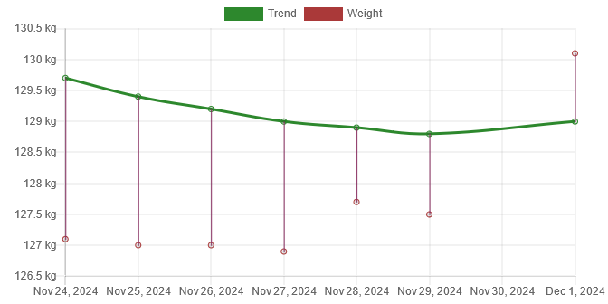

My starting weight was <Measurement>127.1 kg</Measurement> and my ending weight was <Measurement>130.1 kg</Measurement>, i.e., I had a gain of <Measurement>3 kg</Measurement>. There might be some fat gain, but that is mostly water. It'll be down multiple kg again by tomorrow, assuming I stick to my diet target today. Yesterday was a... cheat day of large proportions. I even forgot to weigh myself that morning.

The last time my trend was roughly at <Measurement>129.0 kg</Measurement> was on April 10, 2022, only a week before my trend from last week.

#### Diet

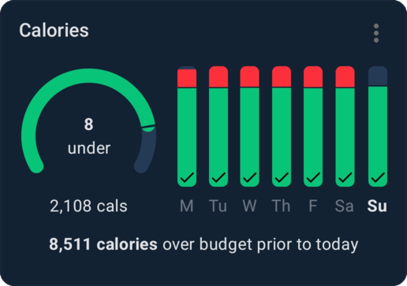

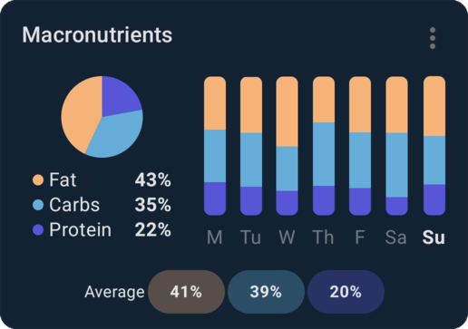

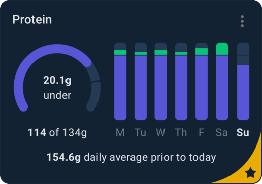

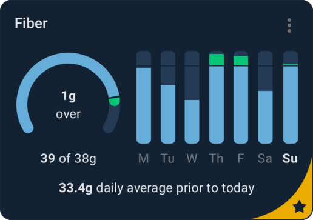

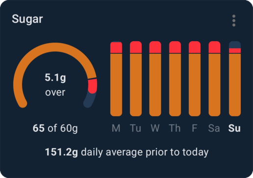

I was ~<Measurement>8500 kcal</Measurement> over my calorie budget this week! Saturday accounts for slightly more than half of that, but that still means I had slightly less than half of that over the course of the rest of the week, too!

Long story short, I went a little overboard on Christmas cookies this week. The snacks were too accessible and too tempting. I've now put them away in a cabinet so they're out of sight. My mind very much responds to "out of sight, out of mind."

The Saturday, however, was just an all out cheat day. I had 74 Christmas cookies in total, amounting to <Measurement>3296 kcal</Measurement> alone. My lunch was also basically a double meal's worth of calories. Breakfast and dinner were pretty normal, though. In total, I had <Measurement>6312 kcal</Measurement> on Saturday. Madness.

Thanks to my protein supplementation (and just eating way too much on Saturday) I'm now meeting or exceeding my protein intake target every day. Nice. My fiber intake could still improve; I'm going to investigate what I can do about that.

Going over everything I eat every week is starting to get tedious, so going forward I'm just going to report anything interesting, like the aforementioned Saturday. On Monday I had 7 Christmas cookies, 23 on Tuesday, 37 on Wednesday, 21 on Thursday and 18 on Friday, a total of 106. Combined with Saturday, that puts my total Christmas cookie intake at 180 Christmas cookies, or an average of 30 per day. I think a reasonable amount would've been ≤ 9 per day.

#### Exercise

- **November 25**:
  - Walking for <Walk hours={1} minutes={31} distance={2.3} />
- **November 26**:
  - Walking for <Walk minutes={45} distance={3.3} />
  - ~1 hour of strength training at the gym
- **November 27**:
  - Walking for <Walk minutes={57} distance={3.9} />
- **November 28**:
  - Walking for <Walk minutes={32} distance={1.6} />
  - ~1 hour of strength training at the gym
- **November 29**:
  - Walking for <Walk hours={1} minutes={58} distance={2.8} />
- **November 30**:
  - ~1 hour of strength training at home
- **December 1**:
  - Walking for <Walk hours={1} minutes={23} distance={7.5} />

This week I walked for <Walk hours={3} minutes={31+45+57+32+58+23} distance={2.3+3.3+3.9+1.6+2.8+7.5} />. I didn't have it in me to go to the gym on Saturday, but I have some dumbbells at home, so I told my app about my equipment and had it make me a routine with what I had. Not as good of a workout as I would've had in the gym, but better than not working out at all!

Here are my exercise summaries from Fitbod this week:

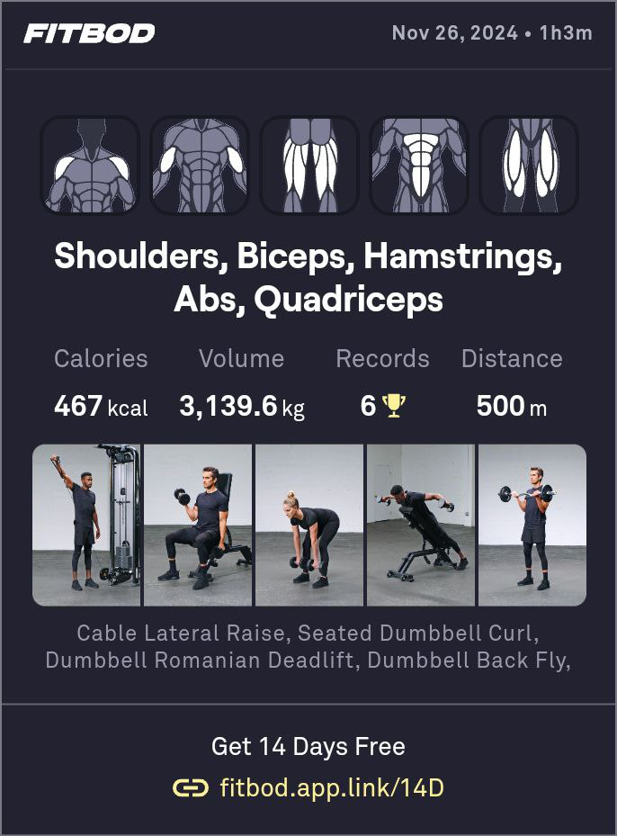

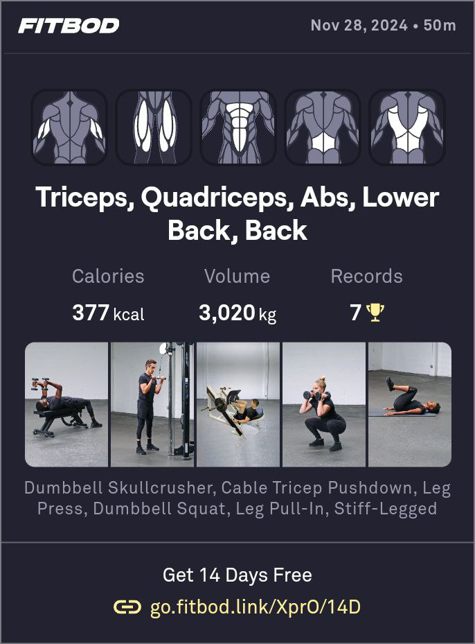

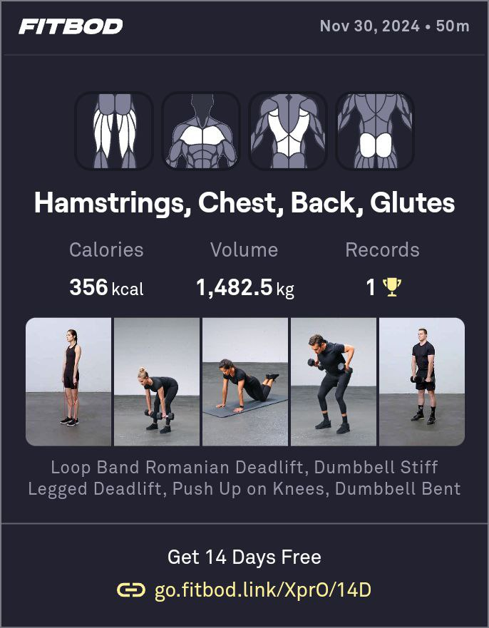

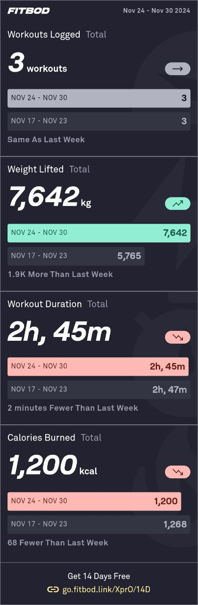

Check it out! My volume's back up again, despite me working out from home one of the days this week.

So far I've been using Fitbod's "Recovered muscles" training splits setting for choosing what exercises to do. It's been working alright, but it feels very unstructured; each session feels very haphazard to me, both which muscles that are trained and which exercises are chosen. Based on what I read on [The Fitness Wiki](https://thefitness.wiki/)'s FAQ entry on "[Should I train full-body or a body-part split?](https://thefitness.wiki/faq/should-i-train-full-body-or-a-body-part-split/)":

> As a beginner, doing a body-part split is not taking advantage of your advanced recovery capabilities. Splits should be left to the more advanced strength trainees who need longer to recover.

I've changed my training splits to "full body" in Fitbod. I'm currently going through [Jeff Nippard](https://www.youtube.com/@JeffNippard)'s [exercises tier lists playlist](https://www.youtube.com/playlist?list=PLp4G6oBUcv8w8ujRtP5BtvJe8PXBwiTdl) to set up my chosen exercises so that my training can be both more optimal and more structured.

#### Sleep

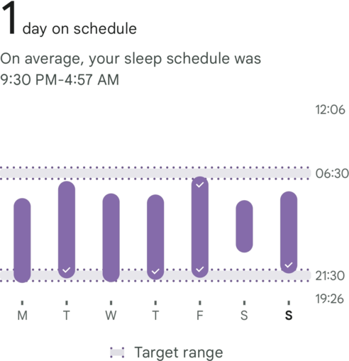

It says 1 days on schedule, but I'm going to count it as 2 since Tuesday is only just shy. You can tell I went out on Friday night seeing how much later I went to bed. Unfortunately, my sleep was also cut very short. Does it make a little more sense why Saturday was a cheat/binge day now? Certainly does to me.

#### Final thoughts

I feel like I had a decent week overall, despite what the numbers say. I think it's important to keep in mind that there are other indicators of success than what the numbers and the data say.

I intend to be more strict with my snack intake next week. Eating an average of 30 cookies per day is just untenable if the goal is losing bodyfat. I'm going to set a hard limit target of 9 cookies or fewer for a given day.

Here is the graph for the last 30 days for today:

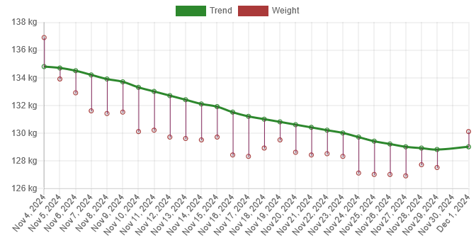
